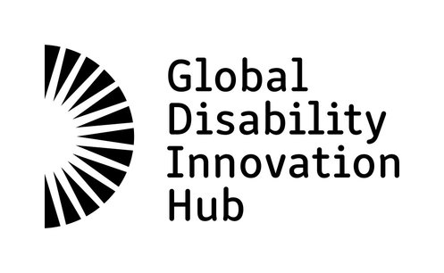
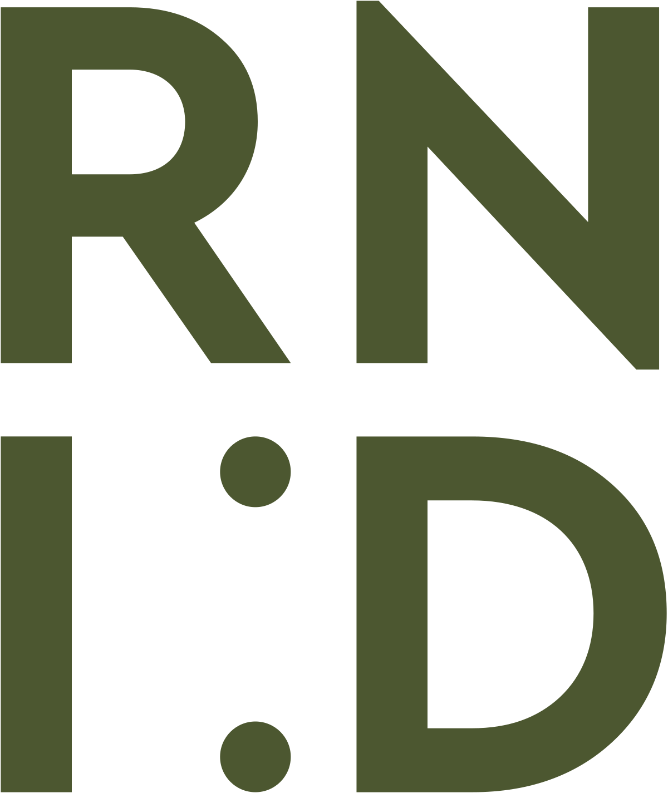

<div align="center">

# AI for Accessibility Toolkit

**AI-powered web accessibility that adapts pages in real-time**

[](https://github.com/chuanenlin/AI-for-Accessibility-Toolkit-Draft/actions/workflows/ci.yml)
[](CONTRIBUTING.md)
[](https://github.com/chuanenlin/AI-for-Accessibility-Toolkit-Draft/graphs/contributors)
[](LICENSE)

[Quick Start](#quick-start) · [Tools](#tools) · [Interfaces](#interfaces) · [Profiles](#profiles) · [API](docs/API.md) · [Troubleshooting](docs/TROUBLESHOOTING.md) · [Contributing](#contributing)

</div>

---

Traditional accessibility tools like [axe-core](https://github.com/dequelabs/axe-core) and [Pa11y](https://github.com/pa11y/pa11y) find issues. This toolkit **fixes them** — AI analyzes the page, understands user needs, and adapts content in real-time. Not a report. A working page.

## Quick Start

### 🧑 End User (Chrome Extension)

```bash
git clone https://github.com/chuanenlin/AI-for-Accessibility-Toolkit-Draft.git
cd AI-for-Accessibility-Toolkit-Draft && npm install && npm run build
```
Load in Chrome: `chrome://extensions` → **Developer mode** → **Load unpacked** → select `extension/` folder

Get a [Gemini API key](https://aistudio.google.com/apikey) → Extension popup → Settings → Paste key

### 💻 Developer (CLI)

```bash
pip install -e . && playwright install chromium
export ANTHROPIC_API_KEY=sk-...
```

```bash
ai4a11y session start                    # Launch browser
ai4a11y session go https://example.com   # Navigate
ai4a11y session audit                    # Run WCAG audit
ai4a11y session enable darkMode          # Enable dark mode
ai4a11y session profile lowVision        # Apply preset
ai4a11y session describe                 # AI describes the page
```

### 💡 [See examples ↗](docs/API.md) — and give us a ⭐ if this helps!

## Tools

The toolkit ships with **auditors** (find issues) and **adapters** (fix them). Teams across the [AI for Accessibility Collective](#whos-building-this) contribute specialized tools — and you can add your own.

| Auditors | Adapters |
|----------|----------|
| missing-alt | generate-alt, generate-labels, generate-captions |
| missing-labels | fix-contrast, simplify-text, wcag-fixes |
| missing-captions | visual-assist, dark-mode, focus-mode, reader-mode |
| poor-contrast | motion-reducer, color-blind, keyboard-nav |
| wcag-issues (axe-core) | read-aloud, voice-commands, auto-transcriber |

Add your own: `ai4a11y create my-tool --type adapter` → see [CONTRIBUTING.md](CONTRIBUTING.md)

**Test site:** [ai4a11y-test-site.vercel.app](https://ai4a11y-test-site.vercel.app/) — intentional accessibility issues for testing

## Interfaces

| Interface | For | AI Backend | Location |
|-----------|-----|------------|----------|
| **[Chrome Extension](#chrome-extension)** | End users — real-time page adaptation | Gemini | `extension/` |
| **[Personalized Extension](#personalized-extension)** | AI-powered onboarding + custom skill builder | Gemini | `personalized-extension/` |
| **[Text Control Web App](#text-control-recommended)** | Type commands to control the browser | Gemini | `webapp/textcontrol/` |
| **[Voice Control Web App](#voice-control)** | Hands-free browser control via voice | Gemini Live | `webapp/voicecontrol/` |
| **[CLI](#cli)** | Developers / coding agents — audits, automation | Claude | `cli/` |

## Chrome Extension

### Install

```bash
git clone https://github.com/chuanenlin/AI-for-Accessibility-Toolkit-Draft.git
cd AI-for-Accessibility-Toolkit-Draft
npm install && npm run build
```

Chrome: `chrome://extensions` → **Developer mode** → **Load unpacked** → select `extension/` folder

**API key** (for AI features): Extension icon → Settings → Enter your Gemini API key

### Getting a Gemini API Key

1. Go to [Google AI Studio](https://aistudio.google.com/app/apikey)
2. Click **Create API Key**
3. Copy the key and paste it in the extension settings

**Note:** The free tier has limited quotas (15 req/min, 1500/day). For regular use, enable billing in [Google Cloud Console](https://console.cloud.google.com/).

**Cost:** Gemini 2.5 Flash is ~$0.15 per 1M input tokens. Describing 100 images costs roughly $0.01-0.05.

## Personalized Extension

AI-powered onboarding that recommends skills based on your needs, plus a custom skill builder for gaps not covered by built-in skills.

### Install

```bash
cd personalized-extension
npm install && npm run build
```

Chrome: `chrome://extensions` → **Developer mode** → **Load unpacked** → select `personalized-extension/extension/` folder

On first install, an onboarding flow walks through your support areas, site types, and needs — then Gemini recommends which skills to enable.

See [`personalized-extension/README.md`](personalized-extension/README.md) for full documentation.

## Browser Control Web Apps

Two browser automation agents — voice or text input. Both use Gemini + browser-harness to control Chrome. Requires Python 3.11+.

### Prerequisites (shared)

1. **Install uv** (fast Python package manager):
   ```bash
   # macOS/Linux
   curl -LsSf https://astral.sh/uv/install.sh | sh
   
   # Or with pip (slower but works everywhere)
   pip install uv
   ```

2. **Chrome with remote debugging:**
   ```bash
   # macOS
   /Applications/Google\ Chrome.app/Contents/MacOS/Google\ Chrome \
     --remote-debugging-port=9222 --user-data-dir=/tmp/chrome-debug
   
   # Linux
   google-chrome --remote-debugging-port=9222 --user-data-dir=/tmp/chrome-debug
   
   # Windows (PowerShell)
   & "C:\Program Files\Google\Chrome\Application\chrome.exe" `
     --remote-debugging-port=9222 --user-data-dir=C:\temp\chrome-debug
   ```

   The backend auto-discovers Chrome on `localhost:9222` at startup (override with `BU_CDP_PORT` or `BU_CDP_WS`).

3. **browser-harness** is bundled at `webapp/browser-harness/` and installed via `uv pip install -e ../../browser-harness` below. Only clone it yourself if the directory is missing:
   ```bash
   cd webapp && git clone https://github.com/browser-use/browser-harness.git
   ```

### Text Control (recommended)

Type commands to control the browser. Uses Gemini 2.5 Flash.

```bash
cd webapp/textcontrol/backend
cp .env.example .env
# Edit .env with your Gemini API key

uv run uvicorn main:app --host 0.0.0.0 --port 8080
```

Open http://localhost:8080 and type commands like "go to google.com".

### Voice Control

Talk to control the browser. Uses Gemini Live API (audio streaming).

```bash
# Backend
cd webapp/voicecontrol/backend
cp .env.example .env
# Edit .env with your Gemini API key

uv run python main.py

# Frontend (new terminal, from repo root)
cd webapp/voicecontrol/frontend
npm install && npm run dev
```

Open http://localhost:3000, click **Start Session**, allow mic, and start talking.

## CLI

For developers, coding agents, and CI/CD pipelines. Requires Python 3.10+.

### Install

```bash
pip install -e .
playwright install chromium  # Download browser binaries
```

### Commands

```bash
# Scaffolding
ai4a11y list tools                    # List all auditors and adapters
ai4a11y list tools --json             # JSON output for coding agents
ai4a11y list profiles                 # List accessibility profiles
ai4a11y create my-adapter --type adapter --profiles blind,cognitive

# Browser session (Playwright + Claude vision)
ai4a11y session start                 # Launch browser
ai4a11y session go https://example.com
ai4a11y session audit                 # Run WCAG audit (axe-core)
ai4a11y session audit --json          # JSON output
ai4a11y session describe              # AI describes the page
ai4a11y session describe --json       # JSON output
ai4a11y session stop                  # Close browser

# Accessibility adapters
ai4a11y session enable darkMode       # Enable dark mode
ai4a11y session enable visualAssist fontScale=150 largeCursor=true
ai4a11y session disable darkMode      # Disable dark mode
ai4a11y session tools                 # List tools and their status
ai4a11y session profile lowVision     # Apply a preset profile
ai4a11y session profiles              # List all available profiles
```

### Available Tools

| Tool | Description |
|------|-------------|
| `visualAssist` | Font scaling, spacing, cursor, focus enhancement |
| `darkMode` | Dark color scheme |
| `motionReducer` | Reduce animations and motion |
| `focusMode` | Hide distractions, show reading progress |
| `readAloud` | Text-to-speech for page content |
| `readerMode` | Clean reading view (article extraction) |
| `voiceCommands` | Voice-controlled navigation |
| `keyboardNav` | Enhanced keyboard navigation |
| `colorBlindMode` | Color vision deficiency filters |
| `autoTranscriber` | Auto-generate captions for media |

Requires `ANTHROPIC_API_KEY` environment variable for AI features.

## Profiles

Select a profile to automatically enable the right tools:

| Profile | What it enables |
|---------|-----------------|
| **Blind** | Auto alt text, labels, WCAG fixes, keyboard nav |
| **Low Vision** | Large text (150%), enhanced focus, high contrast |
| **Color Blind** | Color filters (protanopia, deuteranopia, tritanopia) |
| **Deaf/HoH** | Auto captions, visual emphasis |
| **Motor** | Large cursor, enhanced focus, keyboard nav |
| **Dyslexia** | OpenDyslexic font, wider spacing, focus mode |
| **ADHD** | Focus mode, reduced motion, reader mode |
| **Cognitive** | Simplified text, summaries |
| **Elderly** | Large text, enhanced focus, simplified text |
| **Anxiety** | Calm UI, reduced motion, reader mode |
| **Sensory** | Reduced motion, dark mode, focus mode |
| **Photosensitive** | Dark mode, reduced motion |

## Directory Structure

```
AI-for-Accessibility-Toolkit-Draft/
├── tools/                       # Shared JS code (browser-native)
│   ├── auditors/               # Find issues (missing-alt, poor-contrast, etc.)
│   ├── adapters/               # Fix issues (generate-alt, fix-contrast, etc.)
│   ├── profiles/               # User presets (settings.js, settings.json)
│   └── utils/                  # Shared utilities (ai.js, dom.js, color.js)
│
├── extension/                   # Chrome extension (basic)
│   ├── src/content.js          # Imports tools/, sets Gemini provider
│   ├── background.js           # Service worker (Gemini API)
│   ├── popup.*                 # Extension UI
│   └── manifest.json
│
├── personalized-extension/      # Chrome extension (AI onboarding + skill builder)
│   ├── extension/              # Extension source
│   ├── skill-creator/          # UI for creating custom skills
│   ├── skills/                 # Built-in skill modules
│   └── utils/                  # AI recommender, DOM utils
│
├── webapp/
│   ├── browser-harness/        # CDP browser control daemon (bundled)
│   ├── textcontrol/            # Text-input browser agent
│   │   ├── backend/            # FastAPI + Gemini 2.5 Flash
│   │   └── frontend/           # Vanilla HTML/CSS/JS
│   └── voicecontrol/           # Voice-controlled browser agent
│       ├── backend/            # FastAPI + Gemini Live API
│       └── frontend/           # React UI (transcript, viewport, actions)
│
├── cli/                         # Python CLI
│   ├── ai4a11y.py              # Playwright + Claude vision agent
│   └── cli.py                  # Command wrapper
│
└── pyproject.toml               # pip install ai4a11y
```

## Contributing

### Adding an Adapter

```bash
ai4a11y create fix-tables --type adapter --profiles blind
```

This creates `tools/adapters/fix-tables.js` with:
- Correct imports (`ai.js`, `dom.js`)
- Metadata exports (`name`, `description`, `profiles`)
- `run()` function template
- `axeHandlers` for WCAG rule violations

Then add to `tools/adapters/index.js` and rebuild:

```bash
npm run build
```

### Adding an Auditor

```bash
ai4a11y create missing-landmarks --type auditor
```

Creates `tools/auditors/missing-landmarks.js`. Add to `tools/auditors/index.js`.

### Adding an AI Tool

1. Add provider method in `tools/utils/ai.js`
2. Add handler in `extension/background.js` (Gemini)
3. Add handler in `cli/ai4a11y.py` (Claude)

See [CONTRIBUTING.md](CONTRIBUTING.md) for full guidelines.

## Architecture

**Tools** (auditors + adapters) live in `tools/` and run in the browser. The **AI provider** is swapped at runtime — Gemini for extensions, Claude for CLI. Both share the same adapters.

See [docs/architecture.md](docs/architecture.md) for technical details.

## Who's Building This

| Team | Focus |
|------|-------|
| Google | NAI — Multimodal AI agents that adapt UIs in real-time |
| Stanford | Accessible Interactive Simulations — sonification for BLV STEM learners |
| MIT Media Lab | Universal Memory Assistant — wearable memory aid for older adults |
| UW | AI-Augmented Storytelling — creative expression tools for BLV children |
| UCL GDI Hub | Non-Standard Speech (Whisper fine-tunes), Founders Think |
| RNID | Videoconferencing Agent — real-time accessibility nudges in meetings |
| RIT / NTID | AI-Powered Tutoring Agent — English grammar tutor for DHH students |
| The Arc | AI for Cognitive Accessibility — text simplification for IDD users |

See [projects/](projects/) for contributed code.

## Roadmap

### Month 1 — Collect
- [x] Set up repo
- [x] Define architecture spec
- [x] Define agent cards
- [ ] Collect agent cards from all teams (in progress)

### Month 3 — Build
- [ ] Collect team codebases (in progress)
- [x] Build Chrome extension (prototype 1)
- [x] Build CLI (prototype 2)
- [x] Implement ability profiles
- [x] Support multiple ability profiles
- [x] Prepopulate basic accessibility tools (alt text, labels, contrast, dark mode, focus mode, etc.)
- [ ] Build evaluation benchmark (test sites arena) (in progress)
- [ ] Integrate team projects
- [ ] Co-design with disability community

### Month 6 — Ship
- [ ] Write documentation
- [ ] Create example applications
- [ ] Test with users
- [ ] Publish to Chrome Web Store
- [ ] Publish CLI to PyPI
- [ ] Release publicly

## Contributors

<a href="https://github.com/chuanenlin/AI-for-Accessibility-Toolkit-Draft/graphs/contributors">
  
</a>

We welcome contributions! See [CONTRIBUTING.md](CONTRIBUTING.md) to get started.

## Security

Found a vulnerability? Please report it responsibly. See [SECURITY.md](SECURITY.md).

## License

Apache 2.0. See [LICENSE](LICENSE).

---

<h2 align="center">AI for Accessibility Collective</h2>

<div align="center">
<p>
  <a href="https://www.google.org/"></a>
  &nbsp;&nbsp;
  <a href="https://www.stanford.edu/"></a>
  &nbsp;&nbsp;
  <a href="https://www.washington.edu/"></a>
  &nbsp;&nbsp;
  <a href="https://www.media.mit.edu/"></a>
  &nbsp;&nbsp;
  <a href="https://www.disabilityinnovation.com/"></a>
  &nbsp;&nbsp;
  <a href="https://www.rit.edu/ntid/"></a>
  &nbsp;&nbsp;
  <a href="https://thearc.org/"></a>
  &nbsp;&nbsp;
  <a href="https://rnid.org.uk/"></a>
</p>

</div>
