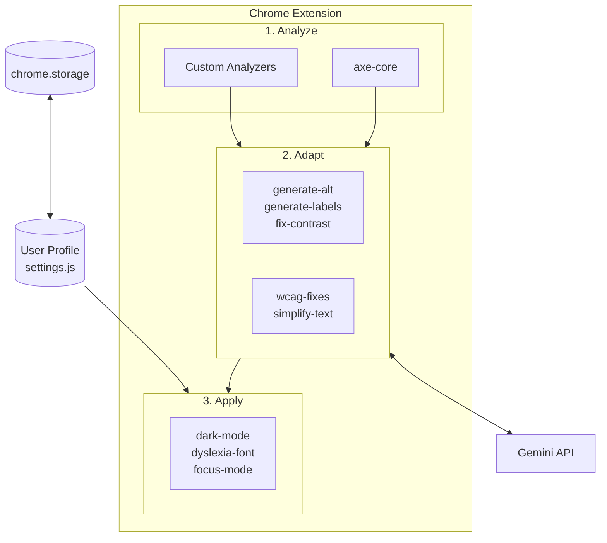

<div align="center">

# AI for Accessibility Toolkit

**AI-powered Chrome extension that adapts any webpage to each user's abilities.**

[](CONTRIBUTING.md)
[](https://github.com/chuanenlin/AI-for-Accessibility-Toolkit/graphs/contributors)
[](LICENSE)

[Install](#install) · [Profiles](#profiles) · [Contributing](#contributing)

</div>

---

Existing tools like [axe-core](https://github.com/dequelabs/axe-core) and [Pa11y](https://github.com/pa11y/pa11y) give you a list of violations. This toolkit *adapts* the page — AI analyzes what the page is, understands what the user needs, and fixes it in real-time. Not a report. A working page.

## Install

```bash
git clone https://github.com/chuanenlin/AI-for-Accessibility-Toolkit.git
cd AI-for-Accessibility-Toolkit
```

Chrome: `chrome://extensions` → **Developer mode** → **Load unpacked** → select this folder

**API key** (for AI features): Extension icon → Settings → Enter your Gemini API key

### Getting a Gemini API Key

1. Go to [Google AI Studio](https://aistudio.google.com/app/apikey)
2. Click **Create API Key**
3. Copy the key and paste it in the extension settings

**Important:** The free tier has very limited quotas (15 requests/minute, 1500/day). For regular use, you'll need to:

1. Go to [Google Cloud Console](https://console.cloud.google.com/)
2. Create or select a project
3. Enable the **Generative Language API**
4. Go to **Billing** → Link a billing account
5. Go to [AI Studio API Keys](https://aistudio.google.com/app/apikey) and create a key for your billed project

**Cost:** Gemini 2.5 Flash is ~$0.15 per 1M input tokens. Describing 100 images costs roughly $0.01-0.05.

## What it does

- Auto-generates alt text for images using AI
- Fixes color contrast issues
- Generates labels for unlabeled form fields
- Simplifies complex text
- Adds captions to media
- Applies visual presets (dark mode, dyslexia font, large cursor, etc.)

## Profiles

Select a profile to automatically enable the right tools:

| Profile | What it enables |
|---------|-----------------|
| **Blind** | Auto alt text, labels, WCAG fixes, keyboard nav |
| **Low Vision** | Large text (150%), enhanced focus, high contrast |
| **Color Blind** | Color filters (protanopia, deuteranopia, tritanopia) |
| **Deaf/HoH** | Auto captions, visual emphasis |
| **Motor** | Large cursor, keyboard nav, voice commands |
| **Dyslexia** | OpenDyslexic font, wider spacing, focus mode |
| **ADHD** | Focus mode, reduced motion, reader mode |
| **Cognitive** | Simplified text, summaries |
| **Elderly** | Large text, enhanced focus, simplified text |
| **Anxiety** | Calm UI, reduced motion, reader mode |
| **Sensory** | Reduced motion, dark mode, focus mode |
| **Photosensitive** | Dark mode, reduced motion |

## Contributing

Add new capabilities with the CLI:

```bash
npm install

npx ai4a11y tools                                   # List components
npx ai4a11y create missing-landmarks --type analyzer    # Find issues
npx ai4a11y create fix-tables --type adapter            # Fix issues
npx ai4a11y create elderly --type profile               # User preset
npx ai4a11y build                                   # Rebuild after changes
npx ai4a11y check https://example.com               # Test a page
```

### Structure

```
src/
├── analyzers/      # Find accessibility issues
├── adapters/       # Fix accessibility issues
├── features/       # Visual presets (dark mode, fonts)
└── settings.js     # Profile configurations
lib/                # Vendor libraries (axe-core, darkreader, etc.)
manifest.json       # Chrome extension manifest
```

### Adding an Analyzer

Analyzers find issues on the page.

```bash
npx ai4a11y create missing-landmarks --type analyzer
```

```js
// src/analyzers/missing-landmarks.js
import { isVisible, wasProcessed } from '../utils/dom.js';

export function findMissingMain() {
  if (document.querySelector('main, [role="main"]')) return [];
  return [document.body];
}
```

Add to `src/analyzers/index.js`:
```js
export * from './missing-landmarks.js';
```

### Adding an Adapter

Adapters fix issues. Map axe rule IDs to fix functions.

```bash
npx ai4a11y create fix-tables --type adapter
```

```js
// src/adapters/fix-tables.js
import { markProcessed } from '../utils/dom.js';
import { logFix, incrementStat } from '../stats.js';

export function fixTableHeaders(table) {
  // Add th elements to first row
  markProcessed(table, 'done');
  incrementStat('wcag');
}

export const axeHandlers = {
  'td-has-header': fixTableHeaders
};
```

Add to `src/adapters/index.js`.

### Adding a Profile

```bash
npx ai4a11y create elderly --type profile
```

Edit `src/settings.js` to configure which tools the profile enables.

### Adding an AI Tool

1. Add handler in `background.js`:
```js
case 'myTool':
  const result = await callGeminiAPI(request.data);
  sendResponse({ success: true, result });
  break;
```

2. Call from adapter:
```js
const response = await sendMessage({ type: 'myTool', data: {...} });
```

See [CONTRIBUTING.md](CONTRIBUTING.md) for full guidelines.

## CLI Reference

```bash
npx ai4a11y tools                              # List analyzers, adapters, features
npx ai4a11y profiles                           # List profiles
npx ai4a11y create <name> --type analyzer      # Scaffold analyzer
npx ai4a11y create <name> --type adapter       # Scaffold adapter
npx ai4a11y create <name> --type profile       # Scaffold profile
npx ai4a11y build                              # Build extension
npx ai4a11y check <url>                        # Test page with axe-core
```

## Architecture



**Flow:**
1. Page loads → extension runs
2. Analyzers scan for issues (axe-core + custom)
3. Adapters fix issues (immediate or via AI)
4. Features apply visual presets based on profile

## Who's Building This

| Team | Focus |
|------|-------|
| Google | NAI — Multimodal AI agents that adapt UIs in real-time |
| Stanford | Accessible Interactive Simulations — sonification for BLV STEM learners |
| MIT Media Lab | Universal Memory Assistant — wearable memory aid for older adults |
| UW | AI-Augmented Storytelling — creative expression tools for BLV children |
| UCL GDI Hub | Non-Standard Speech (Whisper fine-tunes), Founders Think |
| RNID | Videoconferencing Agent — real-time accessibility nudges in meetings |
| RIT / NTID | AI-Powered Tutoring Agent — English grammar tutor for DHH students |
| The Arc | AI for Cognitive Accessibility — text simplification for IDD users |

---

<div align="center">

[Stanford University](https://www.stanford.edu/) · [Google](https://www.google.org/) · [University of Washington](https://www.washington.edu/) · [MIT Media Lab](https://www.media.mit.edu/) · [UCL GDI Hub](https://www.disabilityinnovation.com/) · [RIT/NTID](https://www.rit.edu/ntid/) · [The Arc](https://thearc.org/) · [RNID](https://rnid.org.uk/)

</div>
