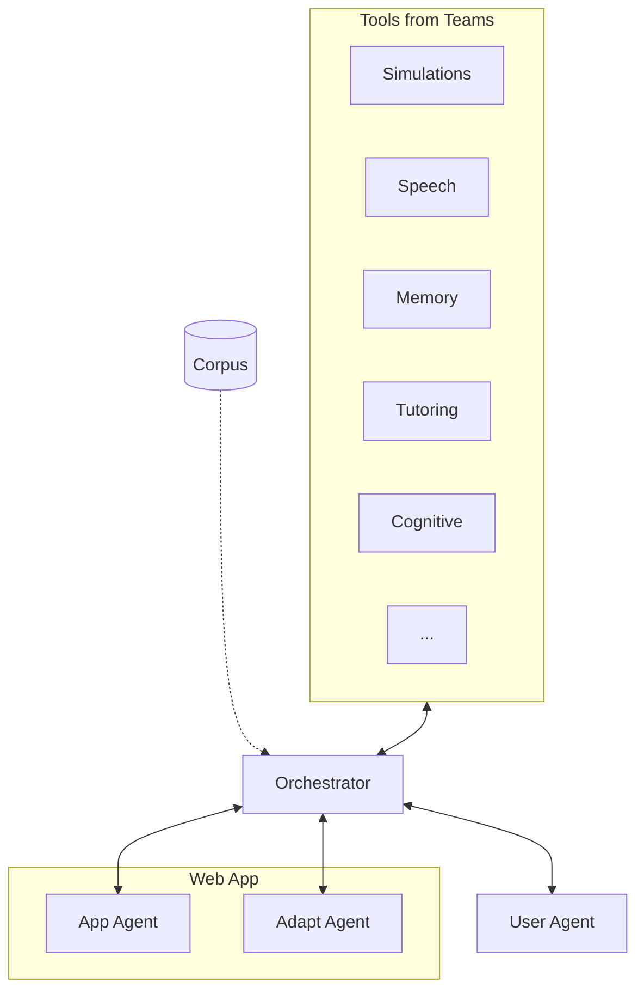

<div align="center">

# AI for Accessibility Toolkit

**AI-powered accessibility toolkit — Chrome extension for end users, CLI for developers.**

[](CONTRIBUTING.md)
[](https://github.com/chuanenlin/AI-for-Accessibility-Toolkit-Draft/graphs/contributors)
[](LICENSE)

[Extension](#chrome-extension) · [CLI](#cli) · [Profiles](#profiles) · [Contributing](#contributing)

</div>

---

Existing tools like [axe-core](https://github.com/dequelabs/axe-core) and [Pa11y](https://github.com/pa11y/pa11y) give you a list of violations. This toolkit *adapts* the page — AI analyzes what the page is, understands what the user needs, and fixes it in real-time. Not a report. A working page.

## Two Interfaces

| Interface | For | AI Backend |
|-----------|-----|------------|
| **Chrome Extension** | End users — real-time page adaptation | Gemini |
| **CLI** | Developers / coding agents — audits, automation, CI/CD | Claude |

Both share the same `tools/` codebase — auditors find issues, adapters fix them.

## Chrome Extension

### Install

```bash
git clone https://github.com/chuanenlin/AI-for-Accessibility-Toolkit.git
cd AI-for-Accessibility-Toolkit
npm install && npm run build
```

Chrome: `chrome://extensions` → **Developer mode** → **Load unpacked** → select `extension/` folder

**API key** (for AI features): Extension icon → Settings → Enter your Gemini API key

### Getting a Gemini API Key

1. Go to [Google AI Studio](https://aistudio.google.com/app/apikey)
2. Click **Create API Key**
3. Copy the key and paste it in the extension settings

**Note:** The free tier has limited quotas (15 req/min, 1500/day). For regular use, enable billing in [Google Cloud Console](https://console.cloud.google.com/).

**Cost:** Gemini 2.5 Flash is ~$0.15 per 1M input tokens. Describing 100 images costs roughly $0.01-0.05.

## CLI

For developers, coding agents, and CI/CD pipelines.

### Install

```bash
pip install -e .
```

### Commands

```bash
# Scaffolding
ai4a11y list tools                    # List all auditors and adapters
ai4a11y list tools --json             # JSON output for coding agents
ai4a11y list profiles                 # List accessibility profiles
ai4a11y create my-adapter --type adapter --profiles blind,cognitive

# Browser session (Playwright + Claude vision)
ai4a11y session start                 # Launch browser
ai4a11y session go https://example.com
ai4a11y session audit                 # Run WCAG audit (axe-core)
ai4a11y session audit --json          # JSON output
ai4a11y session describe              # AI describes the page
ai4a11y session describe --json       # JSON output
ai4a11y session stop                  # Close browser
```

Requires `ANTHROPIC_API_KEY` environment variable for AI features.

## What It Does

- Auto-generates alt text for images using AI
- Fixes color contrast issues
- Generates labels for unlabeled form fields
- Simplifies complex text
- Adds captions to media
- Applies visual presets (dark mode, dyslexia font, large cursor, etc.)

**Test site:** [ai4a11y-test-site.vercel.app](https://ai4a11y-test-site.vercel.app/) — a page with intentional accessibility issues for testing

## Profiles

Select a profile to automatically enable the right tools:

| Profile | What it enables |
|---------|-----------------|
| **Blind** | Auto alt text, labels, WCAG fixes, keyboard nav |
| **Low Vision** | Large text (150%), enhanced focus, high contrast |
| **Color Blind** | Color filters (protanopia, deuteranopia, tritanopia) |
| **Deaf/HoH** | Auto captions, visual emphasis |
| **Motor** | Large cursor, keyboard nav, voice commands |
| **Dyslexia** | OpenDyslexic font, wider spacing, focus mode |
| **ADHD** | Focus mode, reduced motion, reader mode |
| **Cognitive** | Simplified text, summaries |
| **Elderly** | Large text, enhanced focus, simplified text |
| **Anxiety** | Calm UI, reduced motion, reader mode |
| **Sensory** | Reduced motion, dark mode, focus mode |
| **Photosensitive** | Dark mode, reduced motion |

## Directory Structure

```
AI-for-Accessibility-Toolkit/
├── tools/                    # Shared JS code (browser-native)
│   ├── auditors/            # Find issues (missing-alt, poor-contrast, etc.)
│   ├── adapters/            # Fix issues (generate-alt, fix-contrast, etc.)
│   ├── profiles/            # User presets (settings.js, settings.json)
│   └── utils/               # Shared utilities (ai.js, dom.js, color.js)
│
├── extension/               # Chrome extension
│   ├── src/content.js      # Imports tools/, sets Gemini provider
│   ├── background.js       # Service worker (Gemini API)
│   ├── popup.*             # Extension UI
│   └── manifest.json
│
├── cli/                     # Python CLI
│   ├── ai4a11y.py          # Playwright + Claude vision agent
│   └── cli.py              # Command wrapper
│
└── pyproject.toml          # pip install ai4a11y
```

### AI Provider Abstraction

Both interfaces use the same adapters. The AI provider is swapped at runtime:

```javascript
// Extension: uses Gemini via Chrome messaging
setAIProvider({
  describeImage: (data) => chrome.runtime.sendMessage({ type: 'describeImage', data })
});

// CLI: uses Claude via Playwright bridge
setAIProvider({
  describeImage: (data) => window.ai_describeImage(data)  // exposed from Python
});
```

## Contributing

### Adding an Adapter

```bash
ai4a11y create fix-tables --type adapter --profiles blind
```

This creates `tools/adapters/fix-tables.js` with:
- Correct imports (`ai.js`, `dom.js`)
- Metadata exports (`name`, `description`, `profiles`)
- `run()` function template
- `axeHandlers` for WCAG rule violations

Then add to `tools/adapters/index.js` and rebuild:

```bash
npm run build
```

### Adding an Auditor

```bash
ai4a11y create missing-landmarks --type auditor
```

Creates `tools/auditors/missing-landmarks.js`. Add to `tools/auditors/index.js`.

### Adding an AI Tool

1. Add provider method in `tools/utils/ai.js`
2. Add handler in `extension/background.js` (Gemini)
3. Add handler in `cli/ai4a11y.py` (Claude)

See [CONTRIBUTING.md](CONTRIBUTING.md) for full guidelines.

## System Architecture



**Flow:**
1. **Tools** from each team provide specialized capabilities (simulations, speech recognition, memory aids, etc.)
2. **Orchestrator** plans which tools to activate based on page content + user profile
3. **Corpus** provides shared guidelines, benchmarks, and patterns
4. **User Agent** manages preferences and ability profiles
5. **App/Adapt Agents** analyze and modify the web app in real-time

## Who's Building This

| Team | Focus |
|------|-------|
| Google | NAI — Multimodal AI agents that adapt UIs in real-time |
| Stanford | Accessible Interactive Simulations — sonification for BLV STEM learners |
| MIT Media Lab | Universal Memory Assistant — wearable memory aid for older adults |
| UW | AI-Augmented Storytelling — creative expression tools for BLV children |
| UCL GDI Hub | Non-Standard Speech (Whisper fine-tunes), Founders Think |
| RNID | Videoconferencing Agent — real-time accessibility nudges in meetings |
| RIT / NTID | AI-Powered Tutoring Agent — English grammar tutor for DHH students |
| The Arc | AI for Cognitive Accessibility — text simplification for IDD users |

See [projects/](projects/) for contributed code.

## Roadmap

### Month 1 — Collect
- [x] Set up repo
- [x] Define architecture spec
- [x] Define agent cards
- [ ] Collect agent cards from all teams (in progress)

### Month 3 — Build
- [ ] Collect team codebases (in progress)
- [x] Build Chrome extension (prototype 1)
- [x] Build CLI (prototype 2)
- [x] Implement ability profiles
- [x] Support multiple ability profiles
- [x] Prepopulate basic accessibility tools (alt text, labels, contrast, dark mode, focus mode, etc.)
- [ ] Build evaluation benchmark (test sites arena) (in progress)
- [ ] Integrate team projects
- [ ] Co-design with disability community

### Month 6 — Ship
- [ ] Write documentation
- [ ] Create example applications
- [ ] Test with users
- [ ] Publish to Chrome Web Store
- [ ] Publish CLI to PyPI
- [ ] Release publicly

---

<div align="center">

[Stanford University](https://www.stanford.edu/) · [Google](https://www.google.org/) · [University of Washington](https://www.washington.edu/) · [MIT Media Lab](https://www.media.mit.edu/) · [UCL GDI Hub](https://www.disabilityinnovation.com/) · [RIT/NTID](https://www.rit.edu/ntid/) · [The Arc](https://thearc.org/) · [RNID](https://rnid.org.uk/)

</div>
