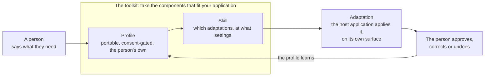

<div align="center">

# AI for Accessibility Toolkit

**An open toolkit for building solutions that adapt digital channels to the person, instead of asking the person to adapt.**

[](LICENSE)

[How it fits](#what-this-is) · [Four terms](#four-terms-to-know-and-what-they-are-called-in-the-code) · [Who it is for](#who-it-is-for) · [Use it](#how-you-can-use-it) · [Contribute](#contributing) · [Docs](docs/README.md)

---

**Not a developer?** The browser extensions built on this toolkit live in the
[extension repository](https://github.com/AI-for-Accessibility-Collective/AI-for-Accessibility-Extension),
with an install guide that needs no coding. This page is for developers.
A plain-words overview of the whole project: [docs/TLDR.md](docs/TLDR.md).

## What this is

The toolkit is not a finished standalone solution: it is the set of components a developer takes, in whatever combination suits what they are building.

The toolkit contains components that developers can use for learning what a person **needs**, keeping that information about their needs and preferences in a **profile**
that stays local to their device, and sharing **skills** (sets of **adaptations** that change digital channels to fit a disabled user better) to their application.  The developer can decide how their applications will use these profiles and skills.


```mermaid
flowchart LR
  accTitle: How the toolkit fits
  accDescr: A person says what they need. Inside the toolkit, a profile holds that understanding and a skill says which adaptations fit. The host application applies the adaptation on its own surface. The person approves, corrects or undoes it, and the profile learns from that. A developer takes whichever toolkit components suit their application.
  subgraph T[The toolkit: take the components that fit your application]
    direction LR
    A[Profile<br/>portable, consent-gated, the person's own] --> S[Skill<br/>which adaptations, at what settings]
  end
  P[A person<br/>says what they need] --> A
  S --> D[Adaptation<br/>the host application applies it,<br/>on its own surface]
  D --> V[The person approves,<br/>corrects or undoes]
  V -- the profile learns --> A
```

How it could work: a person says what they need; the toolkit has a profile which can translate this into specific skills that fit the need; the host application applies the
adaptation on its surface; the person approves, corrects or undoes it, and
the profile learns from that. 

The toolkit is built to be channel agnostic. For example, the table below shows what the same profile could share to three different channels: a browser, a mobile application, or a wearable application, rendered by the renderers in [`toolkit/surfaces/`](toolkit/surfaces/)
(input: `textSize` 1.5 as a floor, `darkTheme`, `reduceMotion`):

| Surface | What the host receives |
|---|---|
| `web.js` | `{ "fontScale": 150, "darkMode": true, "motionReducer": true }` |
| `mobile.js` | `{ "text": { "scalePercent": 150, ... }, "display": { "darkMode": true, ... }, "motion": { "reduceMotion": true }, "touch": { "minTargetPt": 44 }, ... }` |
| `xr.js` | `{ "text": { "angularSizeDeg": 0.525, "worldHeightM": 0.014 }, "ui": { "maxEccentricityDeg": 20, "darkEnvironmentPreferred": true }, "motion": { "reduced": true, "comfortVignette": true, "snapTurning": true }, ... }` |

The mobile renderer's keys mirror the accessibility settings iOS and Android
already expose. The XR renderer expresses text as an angle at the eye,
because a font size means nothing in a headset. This all comes through the same profile: a person using applications across these three channels only needs to be onboarded once. The renderers for each new surface read the same profile.

### Four terms to know, and what they are called in the code

Four terms are key to reading this repository. The internal names stay
where they are in the code; this table is the map between the two. Full
vocabulary and the design principles: [docs/GLOSSARY.md](docs/GLOSSARY.md).
How the pieces fit in depth: [docs/architecture.md](docs/architecture.md).

| Public word | What it means | What it is called in the code |
|---|---|---|
| **Need** | What a person says, in their own words | free text, `supportAreas`, onboarding steps, derived `needs[]` entries |
| **Profile** | The portable understanding of the person, which adjusts its settings based on each person's level of consent | the **AbilityModel** (the device-independent model every surface renders); the **Librarian** (the agent that owns profile and memory, learns from settings over time, and gatekeeps what other applications may read); grants, no-memory zones, the proposal queue |
| **Skill** | Which adaptations to apply, at what settings, for a need | a `SKILL.md` recipe; the **Engineer** (the skill builder that turns a plain-language need plus the profile into a recipe the person validates before it is saved); the registry in `toolkit/registry/` |
| **Adaptation** | The change a host makes in response | **adapter** modules in `tools/adapters/`; auditors; validators; ability presets; surface renderers; the **ports** a host implements |

## What it is not, and where it stands

- **Not an auditor.** Auditors scan a site and hand the developer a report.
  This starts from the person, not the page.
- **Not an overlay.** Overlays are installed by a site owner and give
  everyone the same widget. Here the unit of value is a person's portable
  profile, and nothing is patched on a site owner's behalf.
- **Not assistive technology.** It does not replace a screen reader, a
  magnifier, or anything else a person relies on.
- **Not an application, and not a browser project.** The core ships no user
  interface. The browser was the first channel we could reach people
  through for feedback; web, mobile, XR, desktop and server hosts are all
  first-class.

**Status: an active research project, pre-alpha release.** This is a technology
probe, not a product. It was built to learn from, and things may
break or change without notice. The adaptations in the catalog are
demonstrations; their effectiveness for the people they aim to serve has not
been formally validated. The ability presets are starting points grounded in
prior research, not boxes anyone fits in; see
[docs/PROFILE-CARDS.md](docs/PROFILE-CARDS.md). The work comes from the
[AI for Accessibility Collective](docs/HOW-THIS-WAS-BUILT.md). The current
research phase ends in November 2026; the plan for maintenance and
development after that is still to be confirmed. Open work is tracked in
[ROADMAP.md](ROADMAP.md).

## Who it is for

Every group takes something out and puts something back.

- **People who want their pages adapted**, including people with
  disabilities anywhere in the world: take the browser extensions in the
  [extension repository](https://github.com/AI-for-Accessibility-Collective/AI-for-Accessibility-Extension);
  give feedback, and shape the work as co-designers.
- **Developers building an application**, on web, mobile, XR, desktop or
  server: take the core, the skills library and the catalog, in any
  combination; give back the skills and renderers you write for your
  surface.
- **Developers extending the library**: take the contribution guide and the
  conformance tests; give adapters, auditors, presets and `SKILL.md`
  recipes.
- **Researchers and builders of agentic AI**: take the design principles and
  the architecture; give benchmarks, evaluation methods and findings.

## How you can use it

### Try it in one minute

No install, no API key, no browser. From a clone:

```bash
node toolkit/hosts/xr-demo/demo.js      # onboard on web -> grant -> XR renders -> insight flows back -> accept
node toolkit/hosts/skill-demo/demo.js   # retrieve -> resolve -> build -> validate -> save a skill
node examples/cross-surface.mjs         # one profile -> web + XR, side by side
```

The code walkthrough is in [docs/QUICKSTART.md](docs/QUICKSTART.md); the
method reference is [`toolkit/API.md`](toolkit/API.md).

### Four ways to build on it

1. **Embed the core directly (any JS runtime).** `createToolkit({ ports }) -> { datastore, librarian }`. Implement the ports for your platform; the Node bindings in [`toolkit/platforms/node/`](toolkit/platforms/node/) are the template, and a Chrome host lives in [`toolkit/platforms/chrome/`](toolkit/platforms/chrome/).
2. **Call the hosted HTTP service (any language).** Run [`server/`](server/), locally or on Cloud Run, and use the same Librarian methods over HTTP with a bearer token. See [server/README.md](server/README.md).
3. **Draw from the library and the catalog.** Use the skills, adapters, auditors and presets in [`tools/`](tools/) and the registry in [`toolkit/registry/`](toolkit/registry/) as building blocks, with or without the core.
4. **Drop in one of the other experimental components.** Outside the core, these include a Controller that drives applications through text or voice, an example onboarding service, and a command-line interface (CLI).

The longer description of each component you can build on is in
[docs/COMPONENTS.md](docs/COMPONENTS.md).

### What you need to bring together with the toolkit components

The toolkit is not a complete story on its own. A host brings **ports**
(`KVStore` is required; `Clock`, `Scheduler` and `Consent` default to
built-ins and no-ops), an **actuation port** if it applies changes to a live
surface, an **LLM caller** if it wants the generative features, and an
**onboarding** step that captures needs into a profile. Mind the `Consent`
default: it is a no-op, so a host that does not wire a consent surface gets a
toolkit whose proposals are never shown to anyone. Everything structural
works with no AI provider at all; when one is missing, adapters narrow their
results rather than crash. Details, including the two separate AI seams:
[docs/COMPONENTS.md](docs/COMPONENTS.md#what-a-host-implements).

## Contributing

- **Contribute a skill.** Combine adapters into a `SKILL.md` recipe others can pull. No code, and it exercises the whole validation path.
- **Add an adapter or auditor.** Teach the toolkit to spot a new barrier, or add the adaptation that removes it.
- **Take the components home.** Everything is Apache 2.0; build it into your own application, on any platform. Forks and spin-off versions are part of how this project is meant to be used; see "Forks and spin-offs" in [CONTRIBUTING.md](CONTRIBUTING.md).
- **Shape the benchmarks.** Help define how we verify that an adaptation improved accessibility for the person it was meant for.

Start at [CONTRIBUTING.md](CONTRIBUTING.md). The short version: one feature
per PR, say who benefits (which disability or profile), and involve people
with disabilities in design and evaluation.

A note for developers building with this toolkit: it does not remove your
responsibility to build accessibly. Adapters repair barriers after the fact;
considering accessibility early is still the cheaper and better path. The
[W3C WAI guidance on planning accessibility](https://www.w3.org/WAI/planning-and-managing/)
is a good starting point.

## Security and license

Report vulnerabilities via [SECURITY.md](SECURITY.md), which also states
this repository's security-relevant facts (host-injected AI providers,
profile ids as credentials, the hosted service's tokens). The data-handling
model in one line: single-writer stores, no-memory zones for sensitive
categories, and cross-application sharing only under explicit, revocable
grants. Licensed under Apache 2.0 ([LICENSE](LICENSE)).

## Repository layout

```
toolkit/     Platform-agnostic core: Librarian, datastore, ability model, grants,
             skill engine, ports, sync, protocol, surfaces, the tools registry,
             reference platform bindings, and the runnable demo hosts
tools/       Developer catalog: adapters, auditors, validators, profiles, utils,
             and the ArtInsight knowledge module under insights/
controller/  Optional text/voice control surface: ControlPort, grammar, mounts,
             remote transport, web UI, demo (a sibling; the core never depends on it)
server/      Hosted HTTP service exposing the core to any language/runtime
cli/         Experimental Python CLI: try the catalog on a live page from a terminal
onboarding/  Example web service: /chat, /onboarding, /controller on one port
examples/    Runnable, dependency-free examples
docs/        Quick start, glossary, components, architecture, design docs
scripts/     Repository checks (the packed-package fixture)
```

Paths that moved in the repository split: see the top of
[docs/README.md](docs/README.md). How and by whom this was built:
[docs/HOW-THIS-WAS-BUILT.md](docs/HOW-THIS-WAS-BUILT.md).

---

<h2 align="center">AI for Accessibility Collective</h2>

<div align="center">
<p>
  <a href="https://www.stanford.edu/"></a>
  &nbsp;&nbsp;
  <a href="https://www.washington.edu/"></a>
  &nbsp;&nbsp;
  <a href="https://www.media.mit.edu/"></a>
  &nbsp;&nbsp;
  <a href="https://www.disabilityinnovation.com/"></a>
  &nbsp;&nbsp;
  <a href="https://www.google.org/"></a>
</p>
</div>
