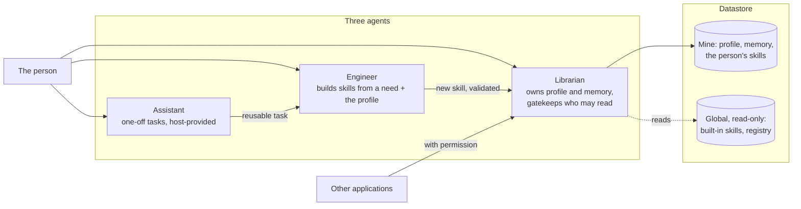

# Glossary and principles

## The four key terms

These are the key terms used in the README, in slides and out loud. The third
column is what a developer meets in the code.

| Public word | What it means | What it is called in the code |
|---|---|---|
| **Need** | What a person says, in their own words | free text, `supportAreas`, onboarding steps, derived `needs[]` entries (`{ dimension, value, strength, unit?, confidence?, source? }`, with strength ranked floor > preference > hint) |
| **Profile** | The portable understanding of the person, which adjusts its settings based on each person's level of consent | AbilityModel, Librarian, memory, grants, no-memory zones, the proposal queue |
| **Skill** | Which adaptations to apply, at what settings, for a need | `SKILL.md`, the Engineer (skill builder), the registry |
| **Adaptation** | The change a host makes in response | adapter modules, auditors, validators, ability presets, surface renderers, ports |

## Additional vocabulary found in the repository

- **AbilityModel.** The device-independent understanding of a person's needs: relative magnitudes, need-named enums, per-dimension confidence. The thing every surface renders. Built by the Librarian from the profile.
- **Librarian.** The personal memory and profile agent (`toolkit/core/librarian.js`). Owns the profile and memory, learns from settings over time, retrieves and builds skills, and gatekeeps what other applications may read.
- **Engineer** (skill builder, `toolkit/core/skill-builder.js`). Turns a plain-language need plus the profile into a `SKILL.md` recipe that composes adapters. The person validates before it is saved.
- **Assistant.** The agent that performs one-off tasks a person asks for and notices when a task is worth keeping as a skill. Host-provided: the toolkit supplies the skill and actuation machinery, the host supplies the agent.
- **Ports.** The small interfaces a host implements: `KVStore`, `Clock`, `Scheduler`, `Consent`, and an actuation port. The core never calls a platform API directly. See `toolkit/ports/`.
- **Surfaces.** Pure renderers in `toolkit/surfaces/` (`web.js`, `mobile.js`, `xr.js`) that map an AbilityModel to one platform's settings. A host may write its own.
- **Adapter.** Executable code that performs one adaptation (dark mode, bigger text, AI alt text). The catalog lives in `tools/adapters/`. Not to be confused with `toolkit/platforms/`, which holds platform bindings and used to be called `toolkit/adapters/`.
- **Auditor.** A detector that finds barriers for adapters to address (missing alt text, low contrast, unlabeled controls). `tools/auditors/`.
- **Validator.** The verifier engine for agentic flows: checks that a page matches what the person asked an agent for and decides how hard to insist. `tools/validators/`.
- **Skill** (`SKILL.md`). A model-facing recipe naming which adapters to apply, with what settings, for a need. Resolves deterministically at apply time, with no LLM.
- **Registry.** The single catalog of tools and their settings vocabulary (`toolkit/registry/tools.js`) that grounds the skill builder and any host UI.
- **Ability preset** (profile). One of the twelve research-informed starting points in `tools/profiles/`. Cold-start defaults, not characterizations of any person or group; see [PROFILE-CARDS.md](PROFILE-CARDS.md).
- **Grant.** A closed-scope permission letting another application read part of a profile. `freeText` and `confidence` are never exportable; revoking a grant deletes it.
- **No-memory zone.** A category of site (finance, health and government by default) where the toolkit adapts but does not take notes.
- **Proposal.** A suggested change to a profile. Proposals stay pending until a person resolves them; nothing about a profile changes silently.
- **ControlPort.** The neutral interface a receiver implements so the Controller can drive it. See [`../controller/PROTOCOL.md`](../controller/PROTOCOL.md).
- **Host.** Any application that embeds the toolkit or calls its hosted service: an extension, a mobile app, an XR app, an assistant, a server.

The three agent codenames, and how they relate:

In words: the person talks to all three; the Assistant hands reusable
tasks to the Engineer; the Engineer's skills reach the store only through
the Librarian, after the person validates; other applications read the
profile through the Librarian, with permission, never from the store.

The new-primitive-versus-new-recipe test for contributors is in
[CONTRIBUTING.md](../CONTRIBUTING.md#skill-or-adapter--which-am-i-building).

## Principles

- **Nothing about us without us.** People with disabilities shape, build and evaluate this work, and are compensated for it.
- **Ability-based.** Adapt to what a person *can* do, not a diagnosis.
- **Suggest, never apply.** Proposals with user validation; no silent changes.
- **Privacy by default.** Single-writer stores, no-memory zones, permission-gated sharing.
- **Platform-agnostic.** The core stays free of any surface; hosts and surfaces bring the platform.
- **Build on existing tools.** axe-core, DarkReader, Readability, and your choice of LLM.

The rules that hold these principles in the code are the invariants in
[architecture.md](architecture.md#invariants).
