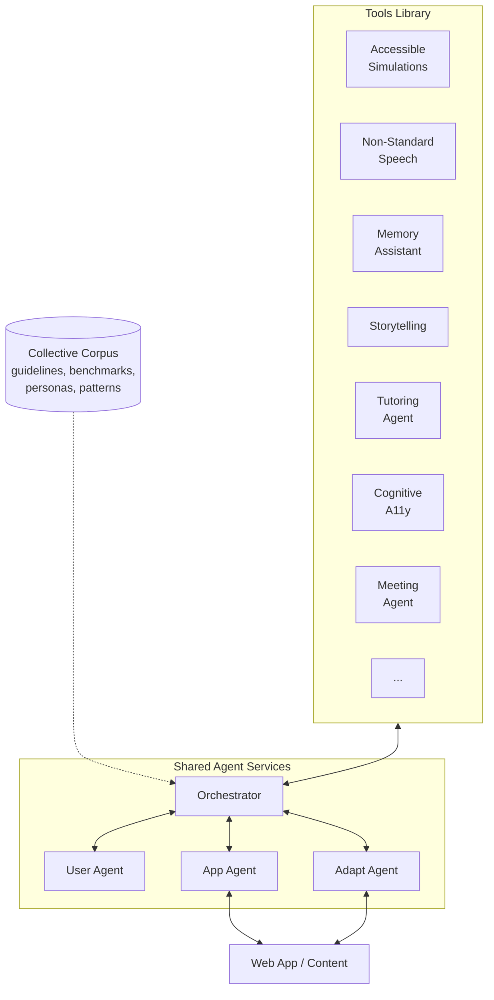
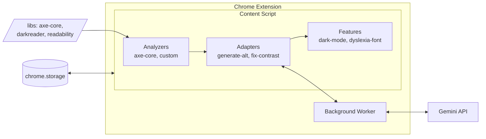

# Architecture

> Chrome extension that adapts web pages in real-time using AI.

## Core Idea

Existing accessibility tools (axe-core, Pa11y) give you a report. This toolkit *adapts* the page — AI analyzes what's on the page, understands what the user needs, and fixes it live. Not a report. A working page.

Teams across the collective contribute capabilities: accessible simulations, atypical speech recognition, memory aids, art descriptions. The extension provides shared infrastructure that these projects can plug into.

## Principles

- **Adapt, don't just audit** — fix issues in real-time, not just report them
- **Ability-based design** — adapt to what users can do, not what they can't
- **Human in the loop** — people with disabilities involved in design and evaluation
- **Build on existing tools** — axe-core for detection, Gemini for AI, darkreader for dark mode
- **Easy to extend** — add new analyzers/adapters with `npx ai4a11y create`

## How It Works



### Agent Services

| Agent | Role |
|-------|------|
| **Orchestrator** | AI plans which tools to activate based on page content + user profile |
| **User Agent** | Preferences, ability profiles, interaction history |
| **App Agent** | Parses web app UI, semantic analysis, accessibility APIs |
| **Adapt Agent** | Generates adaptations, runs modality transforms, resolves conflicts |

### Chrome Extension Implementation

The extension implements this architecture for web browsers:



**Flow:**
1. Page loads → extension runs
2. **Analyzers** scan for issues (axe-core + custom detectors)
3. **Adapters** fix issues (immediate DOM changes or via AI)
4. **Features** apply visual presets based on user's profile
5. **Background** handles AI API calls (Gemini for descriptions, simplification)

## Profiles

Users select a profile that auto-enables the right tools:

| Profile | What it enables |
|---------|-----------------|
| `blind` | Auto alt text, labels, WCAG fixes, keyboard nav |
| `lowVision` | Large text (150%), enhanced focus, high contrast |
| `colorBlind` | Color filters, enhanced contrast |
| `deaf` | Auto captions, visual emphasis |
| `motor` | Large cursor, keyboard nav, voice commands |
| `dyslexia` | OpenDyslexic font, wider spacing, focus mode |
| `adhd` | Focus mode, reduced motion, reader mode |
| `cognitive` | Simplified text, summaries |
| `elderly` | Large text, enhanced focus, simplified text |
| `anxiety` | Calm UI, reduced motion, reader mode |
| `sensory` | Reduced motion, dark mode, focus mode |
| `photosensitive` | Dark mode, reduced motion |

Profiles are defined in `src/settings.js`. Users can also toggle individual tools.

## Extension Structure

```
AI-for-Accessibility-Toolkit/
├── src/
│   ├── analyzers/          # Find issues
│   │   ├── missing-alt.js
│   │   ├── missing-labels.js
│   │   ├── missing-captions.js
│   │   ├── poor-contrast.js
│   │   ├── wcag-issues.js      # axe-core wrapper
│   │   └── index.js
│   ├── adapters/           # Fix issues
│   │   ├── generate-alt.js     # AI image descriptions
│   │   ├── generate-labels.js  # AI form labels
│   │   ├── generate-captions.js # AI audio/video captions
│   │   ├── fix-contrast.js
│   │   ├── simplify-text.js    # AI text simplification
│   │   ├── wcag-fixes.js       # Generic WCAG violation fixes
│   │   └── index.js
│   ├── features/           # Visual presets
│   │   ├── visual-assist.js    # fonts, spacing, cursor, focus
│   │   ├── dark-mode.js        # DarkReader + CSS fallback
│   │   ├── motion-reducer.js   # animations, GIFs, parallax
│   │   ├── color-blind.js      # color correction filters
│   │   ├── focus-mode.js       # distraction hiding, progress
│   │   ├── reader-mode.js      # Readability-based reading view
│   │   ├── read-aloud.js       # text-to-speech
│   │   ├── voice-commands.js   # voice navigation
│   │   ├── keyboard-nav.js     # skip links, tab sequence
│   │   ├── auto-transcriber.js # video/audio captions
│   │   └── index.js            # exports all features
│   ├── utils/              # Helpers (dom, color, image, messaging)
│   ├── settings.js         # Profile definitions
│   ├── stats.js            # Fix tracking and logging
│   ├── constants.js        # Shared constants
│   ├── content.js          # Entry point
│   └── build.js            # esbuild bundler
├── lib/                    # Vendor libraries
│   ├── axe.min.js          # WCAG scanner
│   ├── darkreader.js       # Dark mode
│   ├── OpenDyslexic-Regular.woff2
│   └── ...
├── scripts/cli.js          # CLI (ai4a11y tools, create, build, check)
├── background.js           # AI API calls (Gemini)
├── popup.html / popup.js   # Settings UI
├── manifest.json
└── content.bundle.js       # Built bundle
```

## Adding Capabilities

```bash
npx ai4a11y create missing-landmarks --type analyzer
npx ai4a11y create fix-tables --type adapter
npx ai4a11y create elderly --type profile
npx ai4a11y build
```

See [CONTRIBUTING.md](../CONTRIBUTING.md) for details.

## Multi-Team Collaboration

Teams across the collective contribute specialized capabilities. See [projects.md](projects.md) for detailed cards.

| Project | Team | What it does | Status |
|---------|------|--------------|--------|
| **NAI** | Google | Multimodal AI agents that adapt UIs in real-time | Demo |
| **Accessible Interactive Simulations** | Stanford | Sonification of STEM content for BLV learners | Prototype |
| **Universal Memory Assistant** | MIT Media Lab | Wearable memory assistant for older adults | TBD |
| **AI-Augmented Storytelling** | UW | Creative expression tools for BLV children | TBD |
| **Non-Standard Speech** | UCL GDI Hub | Whisper fine-tunes for atypical speech (13 models) | Published |
| **Founders Think** | UCL GDI Hub | AI tool for disability-innovation founders | TBD |
| **Videoconferencing Agent** | RNID | Real-time accessibility nudges in video calls | Zoom app |
| **AI-Powered Tutoring Agent** | NTID | English grammar tutor for DHH students | TBD |
| **AI for Cognitive Accessibility** | The Arc | Text simplification for IDD users | TBD |

### How projects plug in

Projects contribute as extension components or inform their design:

| Contribution type | Example |
|-------------------|---------|
| **Analyzer** | Stanford: detect inaccessible simulations |
| **Adapter** | The Arc: simplify text for cognitive accessibility |
| **Feature** | MIT: user context/memory tracking |
| **ASR integration** | UCL: non-standard speech recognition |
| **Patterns** | Google NAI: orchestration architecture |
| **Validation** | The Arc: PWD reviewer network |

## Build On, Don't Rebuild

| Need | Use |
|------|-----|
| WCAG detection | [axe-core](https://github.com/dequelabs/axe-core) |
| Dark mode | [darkreader](https://github.com/nicoth-in/darkreader) |
| AI descriptions | [Gemini API](https://ai.google.dev/) |
| Dyslexia font | [OpenDyslexic](https://opendyslexic.org/) |
| Focus management | [focus-trap](https://github.com/focus-trap/focus-trap) |
| Readability | [Mozilla Readability](https://github.com/nicoth-in/readability) |
