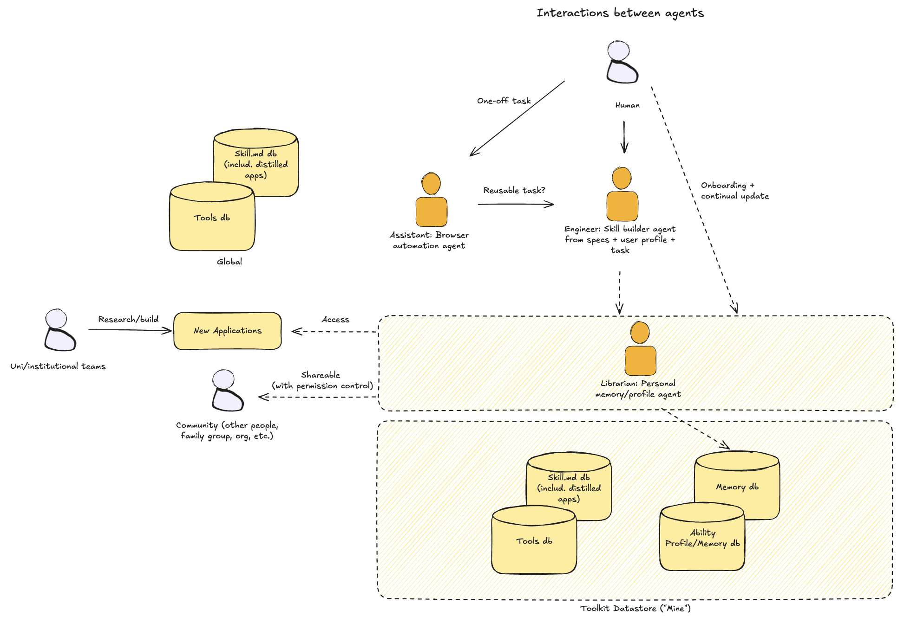
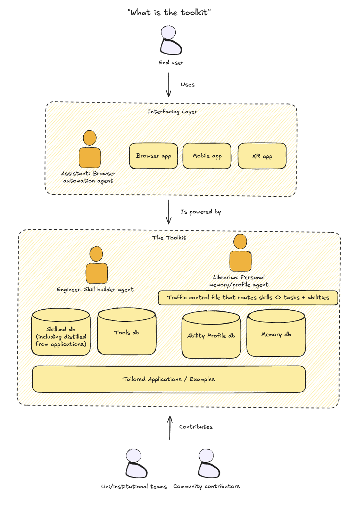
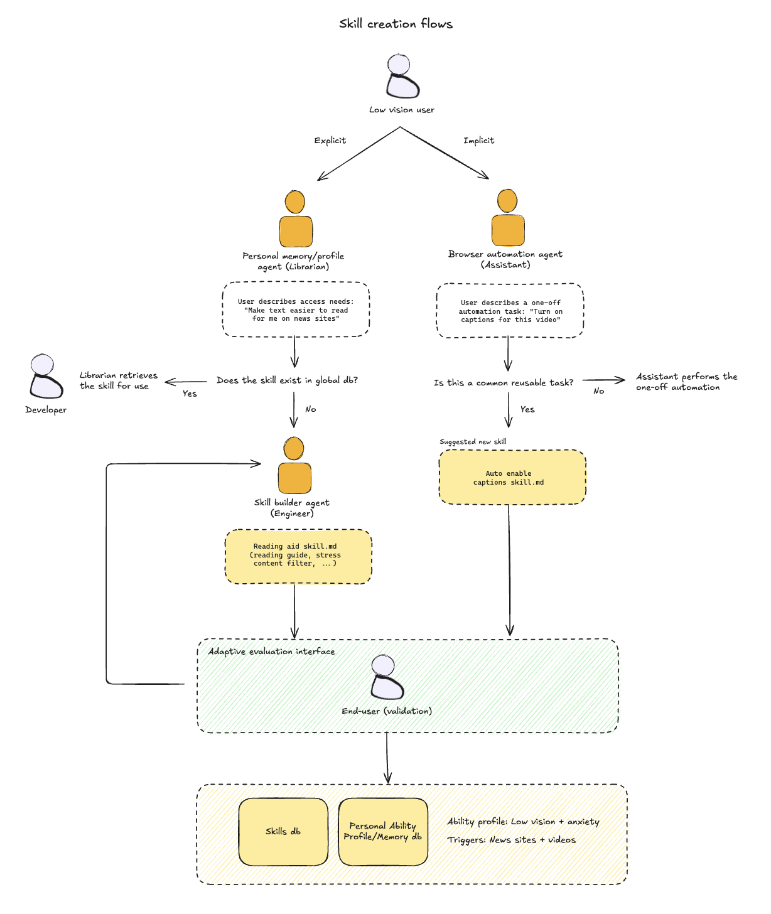
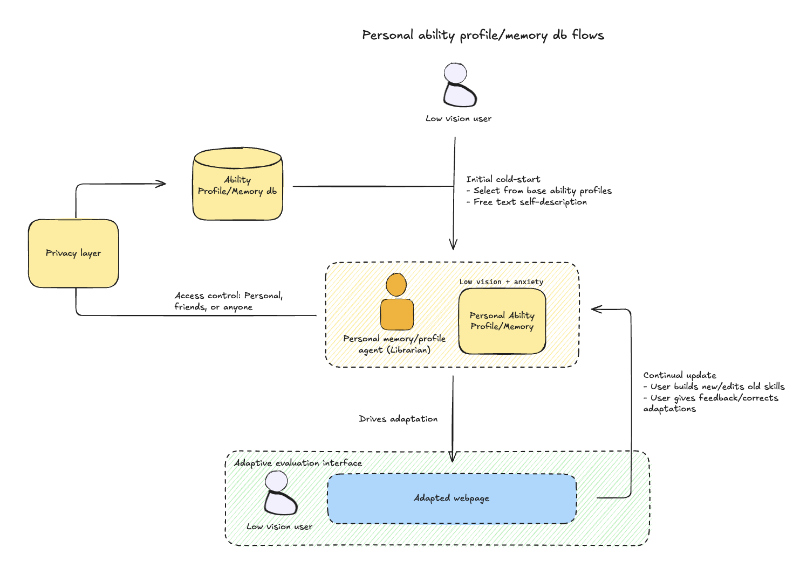
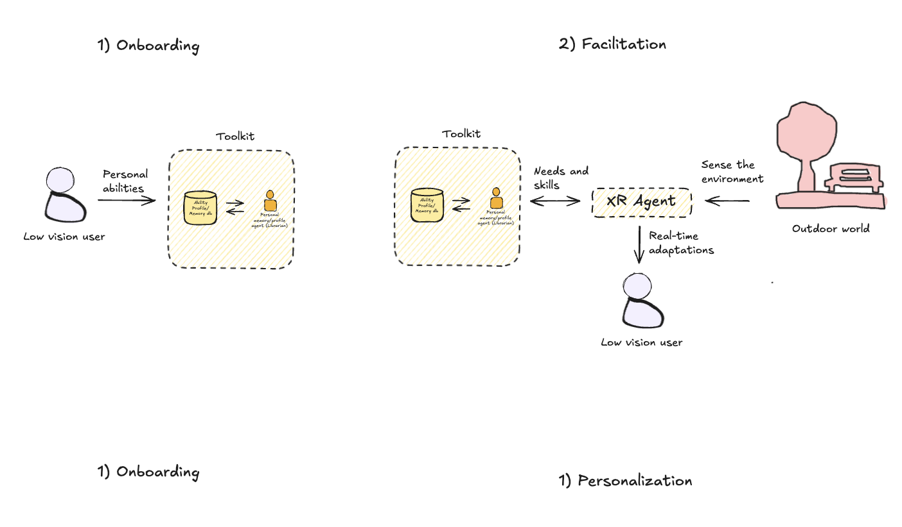
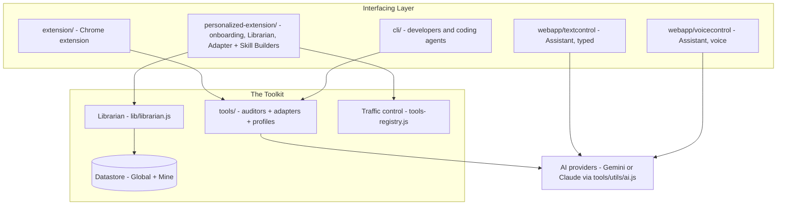

# Architecture

> A toolkit of agents, tools, skills, and a personal ability profile that together adapt any interface — web today, mobile and XR next — to each person's abilities.

## The Big Picture



Three cooperating agents sit between the person and the toolkit's datastore:

| Agent | Codename | Role | Where it lives today |
|-------|----------|------|----------------------|
| **Assistant** | Browser automation agent | Performs one-off tasks the user asks for ("turn on captions for this video"). Detects when a task is *reusable* and hands it to the Engineer. | `webapp/textcontrol/`, `webapp/voicecontrol/`, `personalized-extension/` side panel (voice + browser-harness) |
| **Engineer** | Skill builder agent | Builds new **skills** (SKILL.md recipes composing adapters) from a need + the user's ability profile. Validated by the user before saving. | `toolkit/core/skill-builder.js` (the agent), `personalized-extension/extension/skill-builder/` (the Skill Builder UI) |
| **Librarian** | Personal memory/profile agent | Owns the user's ability profile and memory. Onboards the user, continually updates what it knows, retrieves existing skills, and drives adaptation. Gatekeeps what other apps may read (privacy layer). | `personalized-extension/extension/lib/librarian.js` |

Around them:

- **Toolkit Datastore ("Mine")** — the user's own data: Skill db, Tools db, Memory db, Ability Profile db. Implemented by the catalog facade in `personalized-extension/extension/lib/datastore.js`.
- **Global tier** — read-only data shipped with the toolkit: built-in skills, the tools registry, site taxonomy. Same facade, `global.*`.
- **New Applications** — university/institutional teams research and build apps on top of the toolkit; with the user's permission they *access* the Librarian's understanding instead of re-interviewing the user, and users can *share* skills and profiles with a community (family, org) under permission control.

## Toolkit Layers



The **end user** never sees "the toolkit" — they use an app in the **Interfacing Layer** (the Assistant, a browser extension, a mobile app, an XR app). Every interface is powered by the same **Toolkit** underneath:

- the **Engineer** (skill builder agent) and **Librarian** (personal memory/profile agent),
- a **traffic-control file** that routes skills ↔ tasks + abilities — implemented today as the tools registry (`personalized-extension/skills/registry.js`, compiled to `extension/lib/tools-registry.js`), where every tool declares `supportAreas` (which abilities it helps) and `siteRelevance` (where it applies),
- the four databases (below), and
- **tailored applications / examples** (`projects/`, `webapp/`) that show what can be built.

University teams and community contributors extend the toolkit by adding tools, skills, and applications — see [CONTRIBUTING.md](../CONTRIBUTING.md).

## Terminology — skills vs adapters vs auditors

Two layers do the work, and it matters which is which:

| Term | What it is | Who uses it | Example |
|------|-----------|-------------|---------|
| **Adapter** | The **executable code** that actually adapts a page — the "hands." Developer-authored fixers live in `tools/adapters/`; users generate their own in the **Adapter Builder**. | Runs in the page | `tools/adapters/dark-mode.js`, `generate-alt`, `fix-contrast` |
| **Auditor** | Executable code that **finds** issues (pairs with adapters that fix them). | Runs in the page | `tools/auditors/missing-alt.js` |
| **Skill** (`SKILL.md`) | Model-facing **instructions the LLM/agent reads** to decide *which adapters to call, with what settings, in what order* for a given need and page — the "brain." A recipe can also carry **action steps** (agent tasks saved from the Assistant). Aligns with the Claude Skills convention. | Read by an agent | "Reading aid skill.md → apply `visual-assist` (line spacing) + `focus-mode`" |

**How they connect (the model):** a **skill orchestrates adapters.** The agent reads the skill to know *what to do*; the adapters are *what actually runs*. One skill can compose several adapters. That's why the Engineer is a **skill builder** — it authors the instructions; the adapters are the reusable code those instructions invoke.

> **Implementation status.** The skill→adapter split is built end to end. [`toolkit/core/skill.js`](../toolkit/core/skill.js) parses `SKILL.md` playbooks (frontmatter + a JSON recipe), validates them against the tools registry, and **resolves them deterministically** (no LLM at apply-time). A recipe composes two step kinds: **adapters** (page-fixing settings) and **actions** (tasks the browser agent runs) — the latter is how a reusable task saved from the Assistant becomes a skill. [`toolkit/core/skill-builder.js`](../toolkit/core/skill-builder.js) is the Engineer — it prompts the injected LLM grounded in the real adapter catalog, and accepts a rejected attempt + feedback for revision. Four starter skills ship in [`toolkit/skills/builtin/`](../toolkit/skills/builtin/), and the Librarian exposes `listSkills` / `findSkillForNeed` / `retrieveSkill` / `resolveSkill` / `buildSkill` / `saveSkill` (reachable in the extension via `librarian*` messages; run `node toolkit/hosts/skill-demo/demo.js` to see the whole flow). The **Skill Builder page** (`personalized-extension/extension/skill-builder/`) drives the whole loop in the UI: it offers an existing skill before building a new one, lets the person **try the built skill on the live page** and **send it back with feedback**, and saves or applies only on an explicit click — adapter recipes through the content script, action recipes through the browser agent. **Still legacy:** the older `personalized-extension/skills/builtin/` + `customSkills` path (user-built adapter *code*, run as user-scripts) is unchanged — its internal "skill" identifiers stay pending a storage migration (see [CLAUDE.md](../CLAUDE.md)).

## The Toolkit Datastore

Two tiers, exactly as the catalog facade (`datastore.js`) implements them:

| Tier | Contents | Backing |
|------|----------|---------|
| **Global** (read-only, shipped) | Skill db (built-in skills, incl. ones distilled from applications), Tools db (registry + taxonomy) | Code/assets bundled with the extension |
| **Mine** (the user's own) | Ability Profile db (`mine.profile`, roams via `chrome.storage.sync`), Memory db (episodic log, memory shards, proposals, views), Skill db (`mine.skills`), site index | `chrome.storage`, single-writer (Librarian) |

Memory is sharded by a **scope chain** — `general → context:* → category:* → origin:*` — merged by specificity so a "large text on news sites" preference beats a general default. A **privacy floor** (see `taxonomy.js`) marks finance/health/government as *no-memory zones by default*: profiles can still adapt those pages, but the Librarian records nothing there unless the user opts in.

## Skill Creation Flows



Two paths produce new skills:

**Explicit** — the user describes an access need to the **Librarian** ("Make text easier to read for me on news sites"):
1. Librarian checks whether a matching skill already exists in the **skill db** (built-in or the user's own) → if yes, retrieve and use it. *Built:* `librarian.findSkillForNeed(need)` scores existing skills against the need (deterministic, no LLM), and the Skill Builder page offers the match — "Use it" or "Build a new one anyway" — before the Engineer is asked.
2. If not, the **Engineer** builds one — a `SKILL.md` that composes existing **adapters** into a recipe for this need (e.g. `reading-aid`: `visual-assist` reading guide + `focus-mode`, tuned for news sites). *Built:* `toolkit/core/skill-builder.js` authors it, `toolkit/core/skill.js` validates + resolves it to adapter settings.
3. The result goes through the **adaptive evaluation interface**, where the end user validates it. Fails → back to the Engineer. *Built:* the preview's **Try on this page** applies the unsaved skill to the live page, and a feedback box sends the rejected attempt + the person's words back to the Engineer for revision (`buildSkill(need, { previous, feedback })`).
4. On success it is saved to the **Skills db** and the **Personal Ability Profile/Memory db** records the ability context (e.g., *low vision + anxiety*) and triggers (e.g., *news sites + videos*). *Built:* `saveSkill` logs the skill's `supportAreas` and `siteRelevance` as a high-weight observation the memory pipeline folds into the profile.

**Implicit** — the user asks the **Assistant** for a one-off automation ("Turn on captions for this video"):
1. Assistant asks: is this a common, reusable task? *Built:* a successful agent task on a categorized site triggers a consent-gated proposal (deterministic — works without an API key).
2. No → just perform the one-off automation.
3. Yes → propose a new skill ("auto-enable captions skill.md"), validate through the same adaptive evaluation interface, and save through the same path. *Built:* accepting the proposal saves both the auto-replay profile action **and** a real `SKILL.md` in the Skills db whose recipe carries the task as an **action step** — visible, applicable, and deletable like any other skill.

Either way, **the user validates before anything is saved** — suggestions, never silent application.

## Personal Ability Profile Flows



- **Cold start** — the user selects from base ability profiles (see [Profiles](#profiles)) and/or gives a free-text self-description. The Librarian turns this into the initial Personal Ability Profile.
- **Drives adaptation** — the profile is what the toolkit consults to adapt each page; the user experiences the result directly in the adapted webpage (the adaptive evaluation interface).
- **Continual update** — the profile is living: the user builds new skills, edits old ones, gives feedback, and corrects adaptations; the Librarian folds all of it back into the profile and memory.
- **Privacy layer** — the Ability Profile/Memory db sits behind access control: **personal, friends, or anyone**. Other apps read through the Librarian, never the raw store. *Built:* the popup's "Who can see your profile" choice sets the profile's sharing level, every broker grant carries an **audience** (personal / friends / anyone), and `exportUnderstanding` refuses any grant whose audience sits above the current level — lowering the level immediately cuts off out-of-level grants.

## XR Agent (future direction)



The same toolkit powers an **XR Agent**:

1. **Onboarding** — identical to the web flow: personal abilities → Librarian → Ability Profile/Memory db. Onboard once, use everywhere.
2. **Facilitation** — the XR agent *senses the environment* (the outdoor world), exchanges **needs and skills** with the toolkit (Librarian ⇄ Ability Profile db), and delivers **real-time adaptations** to the user.

This is why the toolkit core must stay platform-agnostic. **The [extraction plan](design/toolkit-refactor-plan.md) is complete (Phases 0–4)**: the Librarian, Datastore, and taxonomy live in the top-level [`toolkit/`](../toolkit/README.md) as pure ES modules behind platform ports, with a Chrome adapter that builds the exact same `extension/lib/*.js` artifacts the extension always loaded. `librarian.getAbilityModel()` returns the device-independent **AbilityModel**, and **SurfaceAdapters** render it per device — `toolkit/surfaces/web.js` produces web settings, `toolkit/surfaces/xr.js` produces FOV-aware angular text size, world-locked captions, and motion-comfort parameters. The cross-app **permission broker** (`toolkit/core/broker.js`) shares that understanding with other apps under default-deny grants — each grant carries an audience (personal / friends / anyone) capped by the profile's sharing level — and a runnable XR host (`node toolkit/hosts/xr-demo/demo.js`) proves the whole loop on in-memory ports. Future work is cross-device transport and native (Swift/C#) conformers.

## How Today's Code Implements This



**Flow in the Chrome extension:**
1. Page loads → content script runs
2. **Auditors** scan for issues (axe-core + custom detectors)
3. **Adapters** fix issues (direct DOM changes or via AI) and apply visual presets
4. **Background worker** makes the AI calls (Gemini)

**Flow in the CLI:** Playwright drives a browser, injects the same `tools/` bundle (`cli/cli-tools.bundle.js`), and uses Claude for AI features — same adapters, different provider, swapped at runtime through `tools/utils/ai.js`.

## Structural Notes (things that look duplicated but aren't)

A few places carry parallel code on purpose. Knowing why keeps contributors
from "fixing" intentional structure:

- **Two Chrome extensions.** `extension/` (basic, imports top-level `tools/`)
  and `personalized-extension/` (onboarding + Librarian memory + Adapter
  Creator) are separate. The personalized one currently keeps its *own* copies
  of the adapter family (`skills/builtin/`) and utils rather than importing
  `tools/`. This **is** known debt — the one real consolidation on the roadmap
  — but it's a deliberate migration (the two adapter APIs diverged and share a
  provider singleton), not a quick merge. Until then, a page-fixing change may
  need to land in both trees.
- **`browser-harness` twice, in two languages.** `webapp/browser-harness/` is
  the upstream **Python** daemon (the web apps run it as a subprocess).
  `personalized-extension/extension/browser-harness/` is a **JavaScript**
  reimplementation over `chrome.debugger` — a browser extension can't spawn a
  Python daemon, so it needs a native-JS port. Same idea, two runtimes; not a
  vendoring mistake.
- **`tools/` vs `toolkit/`.** `tools/` is the browser-native page-fixing
  library (auditors + adapters). `toolkit/` is the platform-agnostic
  person-understanding core (Librarian + memory + ability model). Different
  layers, deliberately distinct names.

## Principles

- **Adapt, don't just audit** — fix issues in real-time, not just report them
- **Ability-based design** — adapt to what users *can* do, not what they can't
- **Suggest, never diagnose** — proposals with user validation, no silent changes, no inferred diagnoses
- **Human in the loop** — people with disabilities involved in design and evaluation
- **Privacy by default** — no-memory zones, single-writer stores, permission-gated sharing
- **Build on existing tools** — axe-core for detection, Gemini/Claude for AI, DarkReader for dark mode
- **Easy to extend** — add new auditors/adapters with `ai4a11y create`

## Profiles

Users select one or more base profiles that auto-enable the right tools (cold-start of the ability profile):

| Profile | What it enables |
|---------|-----------------|
| `blind` | Auto alt text, labels, WCAG fixes, keyboard nav, page outline, announce updates, describe on demand |
| `lowVision` | Large text (150%), enhanced focus, high contrast, highlight links, unpin sticky bars, magnifier, reflow to column, focus locator |
| `colorBlind` | Color filters, enhanced contrast |
| `deaf` | Auto captions, visual emphasis, sound visualizer |
| `motor` | Large cursor, keyboard nav, voice commands, dismiss popups, bigger click targets, page outline, unpin sticky bars, stop auto-advance, focus locator |
| `dyslexia` | Wider spacing, larger text, focus mode, highlight links, bionic reading |
| `adhd` | Focus mode, reduced motion, reader mode, dismiss popups, bionic reading |
| `cognitive` | Simplified text, summaries, dismiss popups, highlight links, define words, stop auto-advance |
| `olderAdult` | Large text, enhanced focus, simplified text, bigger click targets, highlight links, stop auto-advance |
| `anxiety` | Calm UI, reduced motion, dismiss popups, mute sounds |
| `sensory` | Reduced motion, focus mode, dismiss popups, mute sounds, reduce brightness |
| `photosensitive` | Dark mode, reduced motion, reduce brightness, flash guard |

Profiles are defined in `tools/profiles/settings.js`. Users can also toggle individual tools, and every explicit change feeds the Librarian's continual-update loop.

## Directory Structure

```
AI-for-Accessibility-Toolkit/
├── toolkit/                     # Platform-agnostic core (Phase 0 extraction)
│   ├── core/                   # librarian.js, datastore.js, taxonomy.js, ports.js
│   └── adapters/chrome/        # Chrome port implementations (bundled into
│                               #   personalized-extension/extension/lib/)
│
├── tools/                       # Shared Tools db (browser-native JS)
│   ├── auditors/               # Find issues (missing-alt, poor-contrast, ...)
│   ├── adapters/               # Fix issues (generate-alt, dark-mode, ...)
│   ├── profiles/               # Base ability profiles
│   └── utils/                  # ai.js (provider swap), dom.js, color.js
│
├── extension/                   # Chrome extension (basic interface)
│
├── personalized-extension/      # Chrome extension (Librarian + Engineer)
│   ├── extension/lib/          # BUILT from toolkit/ + generated
│   │                           #   tools-registry.js (traffic control)
│   ├── extension/adapter-builder/ # Adapter Builder (generates custom adapter code)
│   ├── extension/skill-builder/  # Skill Builder (Engineer UI — composes adapters into skills)
│   ├── extension/onboarding/   # Ability profile cold-start
│   └── skills/                 # Built-in skills + registry (canonical)
│
├── webapp/                      # Assistant interfaces
│   ├── textcontrol/            # Typed commands (FastAPI + Gemini)
│   ├── voicecontrol/           # Voice (FastAPI + Gemini Live + React)
│   └── browser-harness/        # CDP browser control daemon (bundled)
│
├── cli/                         # Python CLI (Playwright + Claude)
├── projects/                    # Tailored applications from teams
└── docs/
    ├── diagrams/               # Architecture diagrams (source of truth)
    └── design/                 # Internal design docs (proposals, point-in-time snapshots)
        └── toolkit-refactor-plan.md # Plan: extract Librarian into portable core
```

## Multi-Team Collaboration

Teams across the collective contribute specialized capabilities. See [projects.md](projects.md) for detailed cards.

| Project | Team | What it does | Status |
|---------|------|--------------|--------|
| **NAI** | Google | Multimodal AI agents that adapt UIs in real-time | Demo |
| **Accessible Interactive Simulations** | Stanford | Sonification of STEM content for BLV learners | Prototype |
| **Universal Memory Assistant** | MIT Media Lab | Wearable memory assistant for older adults | TBD |
| **AI-Augmented Storytelling** | UW | Creative expression tools for BLV children | TBD |
| **Non-Standard Speech** | UCL GDI Hub | Whisper fine-tunes for atypical speech (13 models) | Published |
| **Founders Think** | UCL GDI Hub | AI tool for disability-innovation founders | TBD |
| **Videoconferencing Agent** | RNID | Real-time accessibility nudges in video calls | Zoom app |
| **AI-Powered Tutoring Agent** | NTID | English grammar tutor for DHH students | TBD |
| **AI for Cognitive Accessibility** | The Arc | Text simplification for IDD users | TBD |

### How projects plug in

| Contribution type | Example |
|-------------------|---------|
| **Auditor** | Stanford: detect inaccessible simulations |
| **Adapter** | The Arc: simplify text for cognitive accessibility |
| **Skill** | Distilled from an application into the global skill db (e.g., ArtInsight → `tools/insights/artinsight/`) |
| **ASR integration** | UCL: non-standard speech recognition |
| **Patterns** | Google NAI: orchestration architecture |
| **Validation** | The Arc: PWD reviewer network |

## Build On, Don't Rebuild

| Need | Use |
|------|-----|
| WCAG detection | [axe-core](https://github.com/dequelabs/axe-core) |
| Dark mode | [darkreader](https://github.com/darkreader/darkreader) |
| AI descriptions | [Gemini API](https://ai.google.dev/) / [Claude API](https://docs.anthropic.com/) |
| Dyslexia-friendly font | [OpenDyslexic](https://opendyslexic.org/) |
| Focus management | [focus-trap](https://github.com/focus-trap/focus-trap) |
| Readability | [Mozilla Readability](https://github.com/mozilla/readability) |
| Browser automation | [browser-harness](https://github.com/browser-use/browser-harness) / [Playwright](https://playwright.dev/) |
