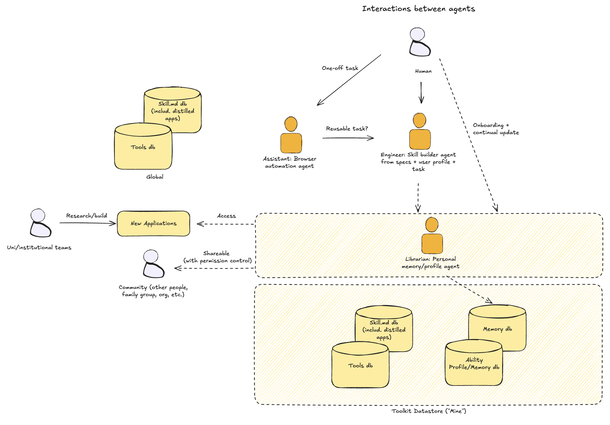
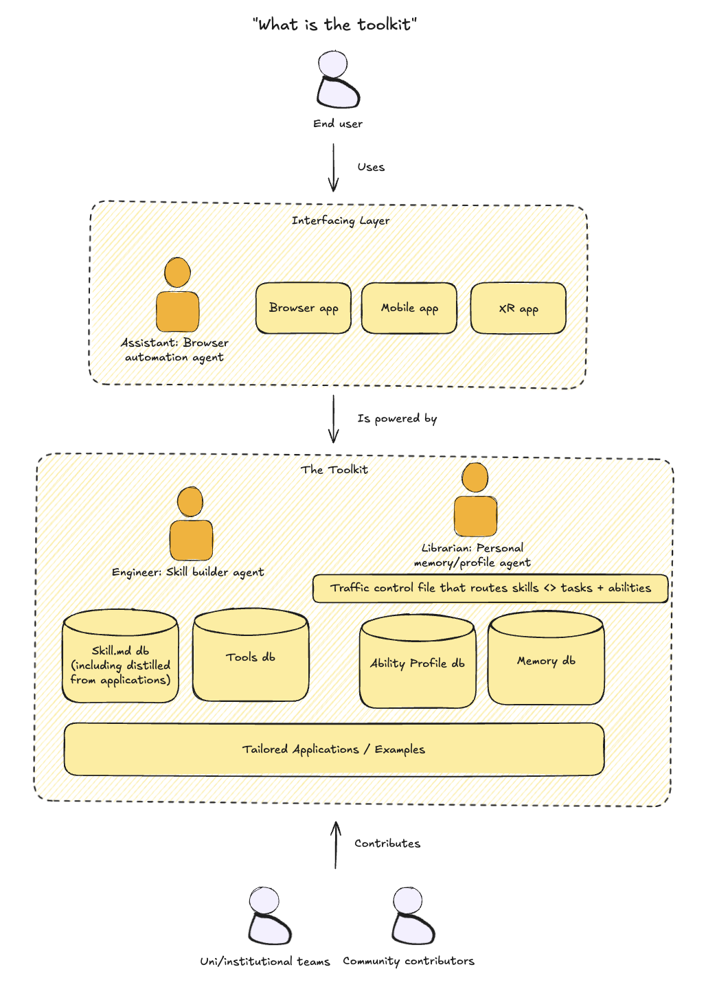
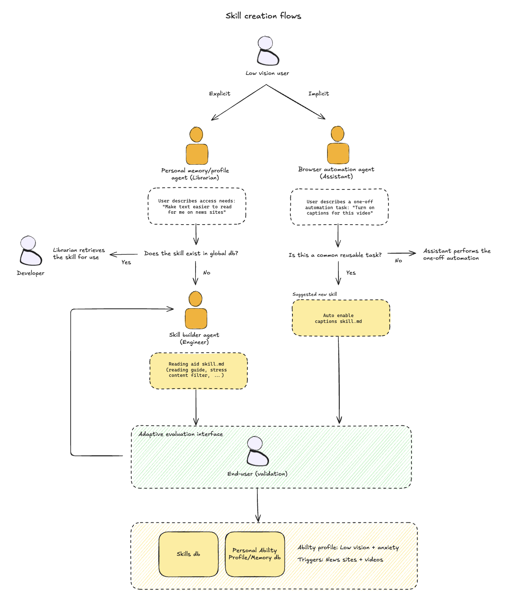
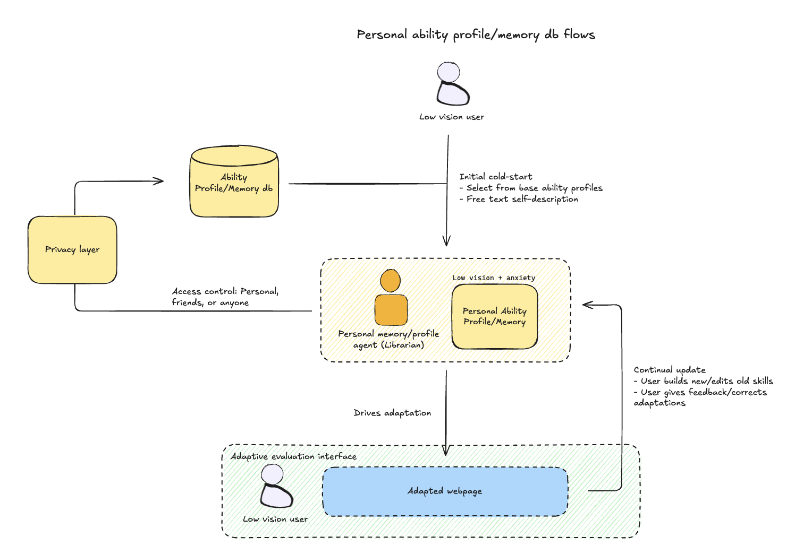
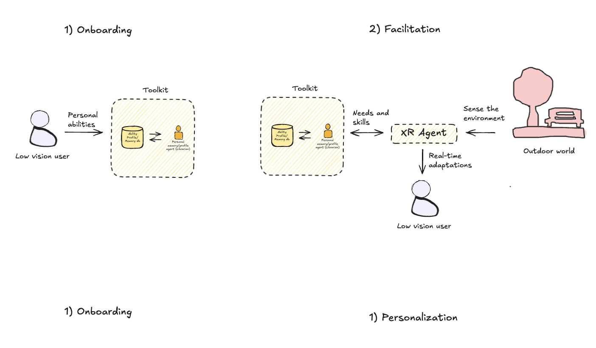
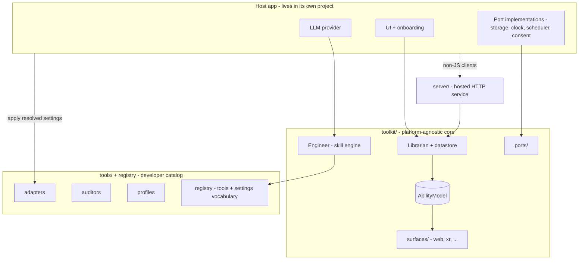

# Architecture

> A toolkit of agents, tools, skills, and a personal ability profile that together adapt any interface — web today, mobile and XR next — to each person's abilities.

## The Big Picture

<p align="center">
  
</p>

Three cooperating agents sit between the person and the toolkit's datastore:

| Agent | Codename | Role | Where it lives |
|-------|----------|------|----------------|
| **Assistant** | Automation agent | Performs one-off tasks the user asks for ("turn on captions for this video") and detects when a task is *reusable*, handing it to the Engineer. | **Host-provided** — the toolkit exposes the skill/action machinery + actuation port; the host supplies the agent |
| **Engineer** | Skill builder agent | Builds new **skills** (SKILL.md recipes composing adapters) from a need + the user's ability profile. Validated by the user before saving. | `toolkit/core/skill-builder.js` |
| **Librarian** | Personal memory/profile agent | Owns the user's ability profile and memory. Learns from settings over time, retrieves/builds skills, drives adaptation, and gatekeeps what other apps may read (privacy layer). | `toolkit/core/librarian.js` |

Around them:

- **Toolkit Datastore ("Mine")** — the user's own data: Skill db, Tools db, Memory db, Ability Profile db. Implemented by the datastore in `toolkit/core/datastore.js`.
- **Global tier** — read-only data shipped with the toolkit: built-in skills, the tools registry, site taxonomy. Same facade, `global.*`.
- **New Applications** — university/institutional teams research and build apps on top of the toolkit; with the user's permission they *access* the Librarian's understanding instead of re-interviewing the user, and users can *share* skills and profiles with a community (family, org) under permission control.

## Toolkit Layers

<p align="center">
  
</p>

The **end user** never sees "the toolkit" — they use a host app (a browser extension, a mobile app, an XR app, an assistant). Every interface is powered by the same **Toolkit** underneath:

- the **Engineer** (skill builder agent) and **Librarian** (personal memory/profile agent),
- a **traffic-control file** that routes skills ↔ tasks + abilities — implemented as the tools registry (`toolkit/registry/tools.js`), where every tool declares `supportAreas` (which abilities it helps) and `siteRelevance` (where it applies),
- the four databases (below), and
- **runnable examples** (`examples/`, `toolkit/hosts/`) plus host apps in their own repos that show what can be built.

University teams and community contributors extend the toolkit by adding tools, skills, and applications — see [CONTRIBUTING.md](../CONTRIBUTING.md).

## Terminology — skills vs adapters vs auditors

Two layers do the work, and it matters which is which:

| Term | What it is | Who uses it | Example |
|------|-----------|-------------|---------|
| **Adapter** | The **executable code** that actually adapts a page — the "hands." Developer-authored fixers live in `tools/adapters/`; a host may let users generate their own at runtime. | Runs in the page | `tools/adapters/dark-mode.js`, `generate-alt`, `fix-contrast` |
| **Auditor** | Executable code that **finds** issues (pairs with adapters that fix them). | Runs in the page | `tools/auditors/missing-alt.js` |
| **Skill** (`SKILL.md`) | Model-facing **instructions the LLM/agent reads** to decide *which adapters to call, with what settings, in what order* for a given need and page — the "brain." A recipe can also carry **action steps** (agent tasks saved from the Assistant). Aligns with the Claude Skills convention. | Read by an agent | "Reading aid skill.md → apply `visual-assist` (line spacing) + `focus-mode`" |

**How they connect (the model):** a **skill orchestrates adapters.** The agent reads the skill to know *what to do*; the adapters are *what actually runs*. One skill can compose several adapters. That's why the Engineer is a **skill builder** — it authors the instructions; the adapters are the reusable code those instructions invoke.

> **Implementation status.** The skill→adapter split is built end to end. [`toolkit/core/skill.js`](../toolkit/core/skill.js) parses `SKILL.md` playbooks (frontmatter + a JSON recipe), validates them against the tools registry, and **resolves them deterministically** (no LLM at apply-time). A recipe composes two step kinds: **adapters** (page-fixing settings) and **actions** (tasks the browser agent runs) — the latter is how a reusable task saved from the Assistant becomes a skill. [`toolkit/core/skill-builder.js`](../toolkit/core/skill-builder.js) is the Engineer — it prompts the injected LLM grounded in the real adapter catalog, and accepts a rejected attempt + feedback for revision. Four starter skills ship in [`toolkit/skills/builtin/`](../toolkit/skills/builtin/), and the Librarian exposes `listSkills` / `findSkillForNeed` / `retrieveSkill` / `resolveSkill` / `buildSkill` / `saveSkill` (called directly when embedding, or via the `librarian*` HTTP routes of `server/`; run `node toolkit/hosts/skill-demo/demo.js` to see the whole flow). A host drives the loop in its own UI: offer an existing skill before building a new one, let the person **try the built skill** and **send it back with feedback**, and save or apply only on explicit confirmation — adapter recipes resolve to settings the host applies, action recipes run through the host's actuation port.

## The Toolkit Datastore

Two tiers, exactly as the catalog facade (`datastore.js`) implements them:

| Tier | Contents | Backing |
|------|----------|---------|
| **Global** (read-only, shipped) | Skill db (built-in skills, incl. ones distilled from applications), Tools db (registry + taxonomy) | Data shipped with the toolkit (`toolkit/registry`, `toolkit/skills/builtin`) |
| **Mine** (the user's own) | Ability Profile db (`mine.profile`, roams via the host's sync storage), Memory db (episodic log, memory shards, proposals, views), Skill db (`mine.skills`), site index | host storage (KVStore port), single-writer (Librarian) |

Memory is sharded by a **scope chain** — `general → context:* → category:* → origin:*` — merged by specificity so a "large text on news sites" preference beats a general default. A **privacy floor** (see `taxonomy.js`) marks finance/health/government as *no-memory zones by default*: profiles can still adapt those pages, but the Librarian records nothing there unless the user opts in.

## Skill Creation Flows

<p align="center">
  
</p>

Two paths produce new skills:

**Explicit** — the user describes an access need to the **Librarian** ("Make text easier to read for me on news sites"):
1. Librarian checks whether a matching skill already exists in the **skill db** (built-in or the user's own) → if yes, retrieve and use it. *Built:* `librarian.findSkillForNeed(need)` scores existing skills against the need (deterministic, no LLM), and the host offers the match — "Use it" or "Build a new one anyway" — before the Engineer is asked.
2. If not, the **Engineer** builds one — a `SKILL.md` that composes existing **adapters** into a recipe for this need (e.g. `reading-aid`: `visual-assist` reading guide + `focus-mode`, tuned for news sites). *Built:* `toolkit/core/skill-builder.js` authors it, `toolkit/core/skill.js` validates + resolves it to adapter settings.
3. The result goes through the **adaptive evaluation interface**, where the end user validates it. Fails → back to the Engineer. *Built:* the preview's **Try on this page** applies the unsaved skill to the live page, and a feedback box sends the rejected attempt + the person's words back to the Engineer for revision (`buildSkill(need, { previous, feedback })`).
4. On success it is saved to the **Skills db** and the **Personal Ability Profile/Memory db** records the ability context (e.g., *low vision + anxiety*) and triggers (e.g., *news sites + videos*). *Built:* `saveSkill` logs the skill's `supportAreas` and `siteRelevance` as a high-weight observation the memory pipeline folds into the profile.

Onboarding is the same door: needs it couldn't cover with a built-in adapter
arrive in the Skill Builder as a queue, each one going through the reuse check
and the Engineer above. Only a need no combination of adapters can cover is
handed to a code-generation path that writes a new adapter — the rare case.

**Implicit** — the user asks the **Assistant** for a one-off automation ("Turn on captions for this video"):
1. Assistant asks: is this a common, reusable task? *Built:* a successful agent task on a categorized site triggers a consent-gated proposal (deterministic — works without an API key).
2. No → just perform the one-off automation.
3. Yes → propose a new skill ("auto-enable captions skill.md"), validate through the same adaptive evaluation interface, and save through the same path. *Built:* accepting the proposal saves both the auto-replay profile action **and** a real `SKILL.md` in the Skills db whose recipe carries the task as an **action step** — visible, applicable, and deletable like any other skill.

Either way, **the user validates before anything is saved** — suggestions, never silent application.

## Personal Ability Profile Flows

<p align="center">
  
</p>

- **Cold start** — the user selects from base ability profiles (see [Profiles](#profiles)) and/or gives a free-text self-description. The Librarian turns this into the initial Personal Ability Profile.
- **Drives adaptation** — the profile is what the toolkit consults to adapt each page; the user experiences the result directly in the adapted webpage (the adaptive evaluation interface).
- **Continual update** — the profile is living: the user builds new skills, edits old ones, gives feedback, and corrects adaptations; the Librarian folds all of it back into the profile and memory.
- **Privacy layer** — the Ability Profile/Memory db sits behind access control: **personal, friends, or anyone**. Other apps read through the Librarian, never the raw store. *Built:* the host's "Who can see your profile" control sets the profile's sharing level, every broker grant carries an **audience** (personal / friends / anyone), and `exportUnderstanding` refuses any grant whose audience sits above the current level — lowering the level immediately cuts off out-of-level grants.

## The Controller (optional control surface)

An **optional** UI layer — a repo-root sibling ([`controller/`](../controller/)),
not part of the platform-agnostic core — that gives a person a **text or voice**
way to drive any app. It is the neutral, go-forward successor to the extension's
old "voice mode": the toolkit kept the *port* and rebuilt the *UI* host-agnostic.

- **`ControlPort`** ([`controller/control-port.js`](../controller/control-port.js))
  — the platform-neutral interface a receiving app implements: `describeCapabilities`,
  `getContext`, `applySettings`, `undoLast`, `resetUndo`, `getContent`,
  `performAction`. A local DOM app, or a mobile / XR / desktop app — each implements
  the same shape in its own terms. It supersedes the web-shaped
  [`toolkit/ports/actuation.js`](../toolkit/ports/actuation.js) (tab/zoom/readPage);
  crucially `getContent` **returns** text for the operator's own delivery channel
  rather than presuming a second speaking voice.
- **Hybrid intent engine.** A zero-dependency grammar over the registry settings
  vocabulary handles "bigger text / dark mode / read this / undo"; an optional,
  host-supplied LLM lane handles free-form phrasing; a `task` catch-all routes
  anything else to a task-capable app (e.g. an agent). When driving a URL, a raw
  mode sends *all* input to the app as tasks (no grammar).
- **Renders itself per operator** ([`controller/presentation.js`](../controller/presentation.js))
  — the widget's own input/output is derived from the operator's AbilityModel
  (voice- vs text-primary, spoken vs live-region delivery, large targets,
  one-step-at-a-time, confirmations). A screen-reader operator gets results in
  their own voice via an ARIA live region, never a second TTS voice.
- **Delivery** — three developer-configured mounts (page / floating element /
  companion); a remote transport
  ([`controller/transport/remote.js`](../controller/transport/remote.js)) runs the
  `ControlPort` over any duplex channel (WebSocket / postMessage / …), so a web
  controller can drive a receiver in another process or on another device. The
  receiver wire contract is [`controller/PROTOCOL.md`](../controller/PROTOCOL.md).

`createController({ control, operator }) → { handle, presentation }`. The core
never imports the controller; the controller imports only the toolkit's settings
vocabulary (`../toolkit/registry/tools.js`). Full design + staged milestones:
[`controller/DESIGN.md`](../controller/DESIGN.md). The [`onboarding/`](../onboarding/)
example service serves a runnable demo at `/controller`.

## XR Agent (future direction)

<p align="center">
  
</p>

The same toolkit powers an **XR Agent**:

1. **Onboarding** — identical to the web flow: personal abilities → Librarian → Ability Profile/Memory db. Onboard once, use everywhere.
2. **Facilitation** — the XR agent *senses the environment* (the outdoor world), exchanges **needs and skills** with the toolkit (Librarian ⇄ Ability Profile db), and delivers **real-time adaptations** to the user.

This is why the toolkit core must stay platform-agnostic. **The [extraction plan](design/toolkit-refactor-plan.md) is complete (Phases 0–4)**: the Librarian, Datastore, and taxonomy live in the top-level [`toolkit/`](../toolkit/README.md) as pure ES modules behind platform ports, with reference platform bindings (`toolkit/platforms/node`, `toolkit/platforms/chrome`) implementing those ports. `librarian.getAbilityModel()` returns the device-independent **AbilityModel**, and **SurfaceAdapters** render it per device — `toolkit/surfaces/web.js` produces web settings, `toolkit/surfaces/xr.js` produces FOV-aware angular text size, world-locked captions, and motion-comfort parameters. Cross-app **permission grants** (`toolkit/sync/grants.js`, resolved by the Librarian) share that understanding with other apps under default-deny grants — each grant carries an audience (personal / friends / anyone) capped by the profile's sharing level — and a runnable XR host (`node toolkit/hosts/xr-demo/demo.js`) proves the whole loop on in-memory ports. Future work is cross-device transport and native (Swift/C#) conformers.

## How the Code Is Organized

A **host** (a web app, mobile app, XR runtime, or the hosted service) embeds the
toolkit. The host brings the platform; the toolkit brings the understanding.


```mermaid
flowchart TB
    subgraph Host[Host app - lives in its own project]
        UI[UI + onboarding]
        PORTS_IMPL[Port implementations - storage, clock, scheduler, consent]
        LLM[LLM provider]
    end

    subgraph Core[toolkit/ - platform-agnostic core]
        LIB[Librarian + datastore]
        ENG[Engineer - skill engine]
        MODEL[(AbilityModel)]
        PORTS[ports/]
        SURF[surfaces/ - web, xr, ...]
    end

    subgraph Catalog[tools/ + registry - developer catalog]
        ADAPTERS[adapters]
        AUDITORS[auditors]
        PROFILES[profiles]
        REG[registry - tools + settings vocabulary]
    end

    SERVER[server/ - hosted HTTP service]

    UI --> LIB
    PORTS_IMPL --> PORTS
    LLM --> ENG
    LIB --> MODEL --> SURF
    ENG --> REG
    SERVER --> LIB
    Host -.non-JS clients.-> SERVER
    Host -->|apply resolved settings| ADAPTERS
```

**Embedding flow:**
1. Host implements the ports (`storage`, `clock`, `scheduler`, `consent`) and calls `createToolkit(...)`.
2. Onboarding + per-app settings feed the **Librarian**, which maintains the **AbilityModel**.
3. A **surface** renders the model to platform settings; the host applies them (optionally using the **catalog** adapters).
4. Plain-language needs go to the **Engineer**, which builds a `SKILL.md` recipe grounded in the registry; the user validates; it resolves deterministically at apply-time.
5. Non-JS hosts do all of the above over HTTP against `server/`.

## Structural Notes

- **`tools/` vs `toolkit/`.** `tools/` is the browser-native catalog of
  page-fixing code (auditors + adapters + profiles) that a web host draws from.
  `toolkit/` is the platform-agnostic person-understanding core (Librarian,
  memory, ability model, skill engine). Different layers, deliberately distinct
  names — the core never imports the catalog.
- **The core is host-free.** `toolkit/core` imports only `toolkit/ports` and
  `toolkit/sync`; it never touches a surface, adapter, or platform API. Hosts
  and surfaces bring the platform. Reference platform bindings live in
  `toolkit/platforms/node/` (the template) and `toolkit/platforms/chrome/`.
- **The Controller is optional.** `controller/` is a UI layer, not part of the
  core — a repo-root sibling that *consumes* the toolkit (it imports only
  `../toolkit/registry/tools.js` for the settings vocabulary). The toolkit never
  depends on it; a host can embed the core with no controller, or drop the
  controller in over a `ControlPort`. See *The Controller* above.
- **Host apps live in their own repos.** This repository is the toolkit and its
  catalog — not any particular application. A web extension, mobile app, or XR
  runtime consumes it (by embedding the ES modules or calling the HTTP service).
- **Validation is machinery, not a bundled UI.** When an agent acts on the
  person's behalf, the toolkit can verify that the page actually matches what
  was asked for and hold the agent before anything hard to undo. That layer's
  *logic* ships in the catalog — the verifier engine (`tools/validators/`, incl.
  its "how hard to insist" `policy.js`), the `contract-mismatch` auditor
  (`tools/auditors/`, which asks "does this match what the person asked?", not
  "is this accessible?"), and the `agent-watch` adapter (`tools/adapters/`, which
  reports a delegate's progress on the page). There is **no bundled validation
  panel or overlay** — that was host UI and lives with the host. A host that
  wants a validation experience composes these pieces and renders its own.
  (`docs/design/verifier-architecture.md` is a point-in-time snapshot and still
  describes the retired extension wiring.)

## Principles

- **Adapt, don't just audit** — fix issues in real-time, not just report them
- **Ability-based design** — adapt to what users *can* do, not what they can't
- **Suggest, never diagnose** — proposals with user validation, no silent changes, no inferred diagnoses
- **Human in the loop** — people with disabilities involved in design and evaluation
- **Privacy by default** — no-memory zones, single-writer stores, permission-gated sharing
- **Build on existing tools** — axe-core for detection, Gemini/Claude for AI, DarkReader for dark mode
- **Easy to extend** — add auditors/adapters to the catalog, skills as `SKILL.md`, or a new surface/port

## Profiles

Users select one or more base profiles that auto-enable the right tools (cold-start of the ability profile):

| Profile | What it enables |
|---------|-----------------|
| `blind` | Auto alt text, form labels, WCAG fixes, landmark repair, announce updates, describe on demand, language tags, explore charts, SPA focus, skip links, accessible math (structure/labels/descriptions — deliberately no magnification, no on-page heading navigator or keyboard-nav overlay, which duplicate/collide with a screen reader) |
| `lowVision` | Large text (150%), enhanced focus, high contrast, highlight links, unpin sticky bars, magnifier, reflow to column, focus locator, explore charts |
| `colorBlind` | Color filters, enhanced contrast |
| `deaf` | Auto captions, visual emphasis, sound visualizer |
| `motor` | Large cursor, keyboard nav, hands-free (spatial voice) navigation, dismiss popups, bigger click targets, page outline, unpin sticky bars, stop auto-advance, focus locator, confirm actions, skip links |
| `dyslexia` | Wider spacing, larger text, focus mode, highlight links, bionic reading, reading ruler |
| `adhd` | Focus mode, reduced motion, reader mode, dismiss popups, bionic reading, reading ruler |
| `cognitive` | Simplified text, summaries, dismiss popups, highlight links, define words, stop auto-advance, confirm actions, save reading spot, expand abbreviations |
| `olderAdult` | Large text, enhanced focus, simplified text, bigger click targets, highlight links, stop auto-advance, save reading spot |
| `anxiety` | Calm UI, reduced motion, dismiss popups, mute sounds |
| `sensory` | Reduced motion, focus mode, dismiss popups, mute sounds, reduce brightness |
| `photosensitive` (shown as **Light Sensitive**) | Dark mode, reduced motion, reduce brightness, flash guard |

Profiles are defined in `tools/profiles/settings.json`. A host can also let users toggle individual tools, and every explicit change feeds the Librarian's continual-update loop.

## Directory Structure

```
AI-for-Accessibility-Toolkit/
├── toolkit/                     # Platform-agnostic core (the library)
│   ├── core/                   # librarian, datastore, ability-model, broker, skill engine
│   ├── ports/                  # host interfaces: KVStore, Clock, Scheduler, Consent, actuation
│   ├── surfaces/               # AbilityModel → per-platform settings (web.js, xr.js)
│   ├── platforms/node/          # reference host port impls (the template a new host copies)
│   ├── platforms/chrome/        # Chrome host port impls (reference)
│   ├── registry/               # canonical tools catalog + settings vocabulary
│   ├── skills/builtin/         # starter SKILL.md recipes
│   ├── sync/ · protocol/       # profile-blob transport + JSON-schema wire contracts
│   ├── hosts/                  # runnable demos (xr-demo, skill-demo)
│   ├── API.md                  # generated core API reference
│   └── test/
│
├── tools/                       # Developer catalog (browser-native JS)
│   ├── auditors/               # find issues (missing-alt, poor-contrast, ...)
│   ├── adapters/               # fix issues (generate-alt, dark-mode, ...)
│   ├── profiles/               # base ability profiles (settings.json)
│   └── utils/                  # ai.js (provider abstraction), dom.js, color.js
│
├── controller/                  # Optional text/voice control surface (a sibling)
│   ├── control-port.js         # the neutral ControlPort contract + honest noop
│   ├── grammar.js · router.js · intent.js   # deterministic intent engine
│   ├── presentation.js         # renders the widget per the operator's AbilityModel
│   ├── llm-lane.js             # optional free-form NL lane
│   ├── web/ · mount/ · transport/           # web UI, mounts, remote transport
│   ├── demo/ · DESIGN.md · PROTOCOL.md
│   └── test/
│
├── onboarding/                  # Example service: capture a profile + serve /controller
├── server/                      # Hosted HTTP service over the core (Cloud Run)
├── examples/                    # Runnable, dependency-free examples (cross-surface.mjs)
└── docs/
    ├── diagrams/               # Architecture diagrams
    └── design/                 # Internal design docs (point-in-time snapshots)
```

Host applications (web extensions, mobile, XR runtimes) are **not** in this
repository — they live in their own projects and consume the toolkit by
embedding the ES modules or calling `server/`.

## Multi-Team Collaboration

Teams across the collective contribute specialized capabilities. See [projects.md](projects.md) for detailed cards.

| Project | Team | What it does | Status |
|---------|------|--------------|--------|
| **NAI** | Google | Multimodal AI agents that adapt UIs in real-time | Demo |
| **Accessible Interactive Simulations** | Stanford | Sonification of STEM content for BLV learners | Prototype |
| **Universal Memory Assistant** | MIT Media Lab | Wearable memory assistant for older adults | TBD |
| **AI-Augmented Storytelling** | UW | Creative expression tools for BLV children | TBD |
| **Non-Standard Speech** | UCL GDI Hub | Whisper fine-tunes for atypical speech (13 models) | Published |
| **Founders Think** | UCL GDI Hub | AI tool for disability-innovation founders | TBD |
| **Videoconferencing Agent** | RNID | Real-time accessibility nudges in video calls | Zoom app |
| **AI-Powered Tutoring Agent** | NTID | English grammar tutor for DHH students | TBD |
| **AI for Cognitive Accessibility** | The Arc | Text simplification for IDD users | TBD |

### How projects plug in

| Contribution type | Example |
|-------------------|---------|
| **Auditor** | Stanford: detect inaccessible simulations |
| **Adapter** | The Arc: simplify text for cognitive accessibility |
| **Skill** | Distilled from an application into the global skill db (e.g., ArtInsight → `tools/insights/artinsight/`) |
| **ASR integration** | UCL: non-standard speech recognition |
| **Patterns** | Google NAI: orchestration architecture |
| **Validation** | The Arc: PWD reviewer network |

## Build On, Don't Rebuild

| Need | Use |
|------|-----|
| WCAG detection | [axe-core](https://github.com/dequelabs/axe-core) |
| Dark mode | [darkreader](https://github.com/darkreader/darkreader) |
| AI descriptions | [Gemini API](https://ai.google.dev/) / [Claude API](https://docs.anthropic.com/) |
| Dyslexia-friendly font | [OpenDyslexic](https://opendyslexic.org/) |
| Focus management | [focus-trap](https://github.com/focus-trap/focus-trap) |
| Readability | [Mozilla Readability](https://github.com/mozilla/readability) |
| Browser automation | [browser-harness](https://github.com/browser-use/browser-harness) / [Playwright](https://playwright.dev/) |
