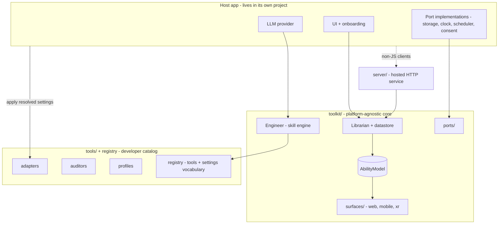

# Architecture

How the system is shaped, and the rules a change must not break. For what
the toolkit is and how to start, read the [README](../README.md); for what
each component does and how to use it, [COMPONENTS.md](COMPONENTS.md); for
the vocabulary, [GLOSSARY.md](GLOSSARY.md).

Contents: [The shape](#the-shape) · [One need, end to end](#one-need-end-to-end) ·
[Skill creation](#skill-creation) · [Privacy and consent](#privacy-and-consent) ·
[Invariants](#invariants) · [Channel agnostic](#channel-agnostic)

## The shape

A **host** (a web app, mobile app, XR runtime, or the hosted service) embeds
the toolkit. The host brings the platform; the toolkit brings the
understanding of the person.

```mermaid
flowchart TB
    subgraph Host[Host app - lives in its own project]
        UI[UI + onboarding]
        PORTS_IMPL[Port implementations - storage, clock, scheduler, consent]
        LLM[LLM provider]
    end

    subgraph Core[toolkit/ - platform-agnostic core]
        LIB[Librarian + datastore]
        ENG[Engineer - skill engine]
        MODEL[(AbilityModel)]
        PORTS[ports/]
        SURF[surfaces/ - web, mobile, xr]
    end

    subgraph Catalog[tools/ + registry - developer catalog]
        ADAPTERS[adapters]
        AUDITORS[auditors]
        PROFILES[profiles]
        REG[registry - tools + settings vocabulary]
    end

    SERVER[server/ - hosted HTTP service]

    UI --> LIB
    PORTS_IMPL --> PORTS
    LLM --> ENG
    LIB --> MODEL --> SURF
    ENG --> REG
    SERVER --> LIB
    Host -.non-JS clients.-> SERVER
    Host -->|apply resolved settings| ADAPTERS
```

Four parts, and the arrows only run one way between them:

1. **The core** (`toolkit/`): the Librarian and its datastore, the
   AbilityModel, the skill engine, ports, surfaces, grants and sync. Pure
   ES modules; imports nothing outside `toolkit/`.
2. **The catalog** (`tools/` and `toolkit/registry/`): adapters, auditors,
   validators, presets, and the registry that names them. The core never
   imports it; a host does.
3. **Hosts**: the browser extensions (extension repository), `server/`, the
   `onboarding/` example service, the demo hosts under `toolkit/hosts/`.
   They implement the ports and apply what the core resolves.
4. **Optional siblings**: `controller/`. Consumes the toolkit's settings
   vocabulary; the toolkit never depends on it.

## One need, end to end

The same path every host follows, with the files that carry each step.

1. **A need arrives.** Onboarding captures `supportAreas`, free text and a
   note, or a person picks a preset from `tools/profiles/settings.json`, or
   they change a setting in the host. Each becomes an observation the
   Librarian (`toolkit/core/librarian.js`) logs.
2. **The profile absorbs it.** The Librarian is the single writer to the
   person's own tier of the datastore (`toolkit/core/datastore.js`): the
   ability profile (`mine.profile`, which roams through the host's sync
   storage), memory (episodic log, memory shards, proposals, views), the
   person's skills (`mine.skills`) and a site index. A read-only global
   tier ships with the toolkit: built-in skills and the tools registry.
   Storage is reached only through the `KVStore` port.
3. **The model is derived.** `librarian.getAbilityModel()` folds the
   profile and memory into the **AbilityModel**: relative magnitudes,
   need-named enums, per-dimension confidence, and no platform units. A
   `needs[]` entry carries a dimension, a value, a strength (floor,
   preference or hint, in that order of weight) and its source.
4. **A surface renders it.** `toolkit/surfaces/web.js`, `mobile.js` and
   `xr.js` are pure functions from the model to one platform's settings.
   The host applies them, optionally through catalog adapters. A host with
   a new surface writes a new renderer; it does not touch the core.
5. **A skill resolves.** For a plain-language need, the Librarian first
   looks for a matching skill (`findSkillForNeed`, deterministic scoring,
   no model). A `SKILL.md` recipe resolves through `toolkit/core/skill.js`
   into adapter settings, validated against the registry. No model runs at
   apply time.
6. **Feedback returns.** Every explicit change, correction, saved skill and
   resolved proposal is logged as an observation the memory pipeline folds
   back into the profile. This is the loop; step 1 again.

Non-JS hosts do all of this over HTTP against `server/`, which exposes the
same Librarian methods behind a bearer token.

## Skill creation

  

Two paths produce a new skill; both end with the person validating before
anything is saved.

**Explicit.** A person describes a need to the Librarian ("make text
easier to read for me on news sites"). The reuse check runs first: if a
built-in or personal skill scores against the need, the host offers it
("use it" or "build a new one anyway") before the Engineer is asked. If
none fits, the Engineer (`toolkit/core/skill-builder.js`) composes existing
adapters into a `SKILL.md` for this need; `skill.js` validates and resolves
it. The host shows the result; a rejection goes back to the Engineer with
the person's words (`buildSkill(need, { previous, feedback })`). On
acceptance the skill is saved and its `supportAreas` and `siteRelevance`
are logged as a high-weight observation. Onboarding needs that no built-in
adapter covers enter this same path as a queue. Only a need no combination
of adapters can meet is handed to a code-generation path that writes a new
adapter, and that path is gated.

**Implicit.** A person asks the Assistant (host-provided) for a one-off
task ("turn on captions for this video"). A successful task on a
categorized site triggers a consent-gated proposal, deterministically and
without an API key: keep this as a skill? Accepting saves both the
auto-replay profile action and a real `SKILL.md` whose recipe carries the
task as an action step, visible and deletable like any other skill.

The validation *surface* (preview, try-on-page, feedback box) is host UI.
The toolkit ships the machinery: the verifier engine in `tools/validators/`
with its "how hard to insist" policy, the `contract-mismatch` auditor (does
this match what the person asked, not is this accessible) and the
`agent-watch` adapter (reports a delegate's progress). A host that wants a
validation experience composes those and renders its own.

## Privacy and consent

  

The ability profile is the most sensitive thing the toolkit holds, so the
mechanics are in the code rather than in policy text:

- **Single writer.** Only the Librarian writes the person's tier. Other
  applications read through it, never the raw store.
- **Local by default.** The profile lives in host storage through the
  `KVStore` port. Sending it to a server ("remote mode") is a host's
  choice, and a standard install cannot arrive with it preconfigured.
- **No-memory zones.** On finance, health and government sites the toolkit
  adapts but takes no notes, unless the person switches that on.
- **Sharing level and audiences.** The person sets who may see their
  profile: personal, friends or anyone. Every cross-application grant
  (`toolkit/sync/grants.js`, resolved by the Librarian) carries an
  audience, and `exportUnderstanding` refuses any grant whose audience sits
  above the current level; lowering the level cuts off out-of-level grants
  immediately.
- **Grants are closed-scope, default-deny and revocable.** `freeText` and
  `confidence` are never exportable. Revoking a grant deletes it.
- **Proposals stay pending.** Any change the toolkit suggests to the profile
  waits until the person resolves it. The `Consent` port is how a host
  shows them; a host that leaves it as the no-op default gets a toolkit
  whose proposals are never seen, and still never applied.

## Invariants

Rules a pull request must not break. Each has a test or a CI check where
one is possible; the rest are reviewed.

1. **The core is host-free.** `toolkit/core` imports only `toolkit/ports`
   and `toolkit/sync`. It never touches a surface, an adapter or a platform
   API. Reference port implementations live in `toolkit/platforms/node/`
   (the template) and `toolkit/platforms/chrome/`.
2. **The core never imports the catalog.** `tools/` is browser-native
   adaptation code a web host draws from; `toolkit/` is the person-
   understanding core. Different layers, deliberately different names.
3. **The Controller is optional in both directions.** `controller/` imports
   only `toolkit/registry/tools.js`; the toolkit never imports the
   controller.
4. **Validation is machinery, not a bundled UI.** No validation panel or
   overlay ships in this repository.
5. **Host applications live in their own repositories.** This repository is
   the toolkit and its catalog, not any application.
6. **No model at apply time.** Skills resolve deterministically; a model may
   author a skill, never apply one.
7. **Nothing changes a profile silently.** Proposals require resolution;
   the person validates a skill before it is saved.

## Channel agnostic

Nothing in a profile, a skill or the core assumes a specific channel; both a browser extension and an XR agent were in the concept from the start (onboard once, then an agent that senses
the environment and delivers adaptations in the headset), which is why the
core stayed platform-agnostic. The XR renderer produces field-of-view-aware angular text size, world-locked captions and motion-comfort parameters from the same model the web renderer
reads, and `node toolkit/hosts/xr-demo/demo.js` runs the whole loop
(onboard on web, grant, XR renders, insight flows back, accept) on
in-memory ports. Open: cross-device transport, native (Swift, C#)
conformers, and the check that an adaptation actually landed in its channel.
Tracked in [ROADMAP.md](../ROADMAP.md).

## See also

- [GLOSSARY.md](GLOSSARY.md), the vocabulary and the principles
- [COMPONENTS.md](COMPONENTS.md), what each piece does and how to use it
- [PROFILE-CARDS.md](PROFILE-CARDS.md), the presets and their status
- [projects.md](projects.md), how Collective projects connect to the toolkit
- [../CLAUDE.md](../CLAUDE.md), the code map
- [design/](design/), point-in-time plans and analyses
